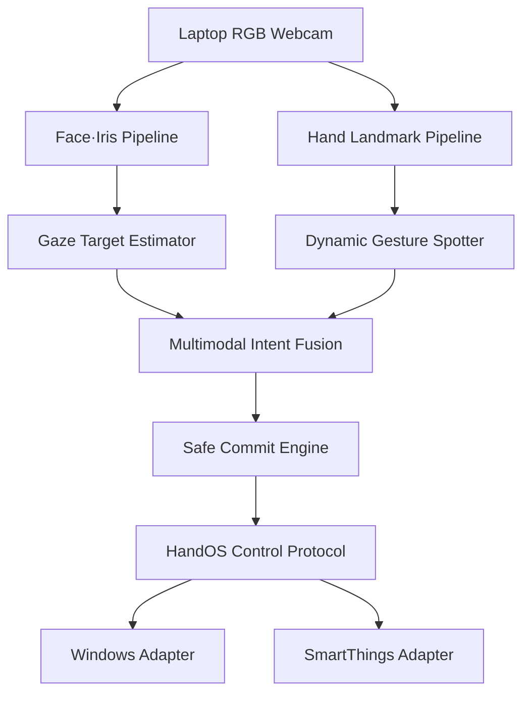

# 26s-w3-c3-05
몰입캠프 26s-w3-c3-05 프로젝트 repository
# HandOS 기획안 v1.0

## 시선 기반 모션 제스처 전자기기 제어 OS

> **바라보면 선택되고, 움직이면 실행된다.**
> 

---

# 1. 프로젝트 개요

### 프로젝트명

**HandOS — Gaze-Grounded Motion Control Runtime**

### 한 줄 정의

일반 노트북 웹캠으로 사용자의 시선과 손동작을 실시간 분석하여, 사용자가 바라보는 전자기기를 선택하고 손 제스처로 명령을 실행하는 멀티모달 전자기기 제어 런타임이다.

### 핵심 인터랙션

```
시선으로 기기 선택
→ 손 제스처로 명령 입력
→ 기기에 맞는 기능 실행
```

예를 들어 같은 `Swipe Down` 제스처라도:

- 노트북을 바라보면 페이지 스크롤
- 스마트 전구를 바라보면 밝기 감소
- TV를 바라보면 볼륨 감소 (확장)
- 에어컨을 바라보면 온도 감소 (확장)

로 해석한다.

---

# 2. 프로젝트 배경

현재 전자기기는 각각 다른 입력 장치를 사용한다.

| 전자기기 | 일반적인 조작 방식 |
| --- | --- |
| 노트북 | 키보드·마우스 |
| TV | 리모컨 |
| 에어컨 | IR 리모컨 |
| 선풍기 | 버튼·리모컨 |
| 스마트 조명 | 모바일 앱 |

HandOS는 이러한 입력 체계를 하나의 공간 인터페이스로 통합한다.

```
무엇을 조작할 것인가? → 시선
어떤 동작을 수행할 것인가? → 손 제스처
언제 실행할 것인가? → Intent Fusion
어떻게 실행할 것인가? → Device Protocol
```

---

# 3. 핵심 문제

## 핵심 질문

> 일반 RGB 웹캠만 사용하여 사용자가 바라보는 등록 기기를 실시간으로 추정하고, 시선과 동적 손 제스처의 시간적 관계를 분석하여 잘못된 기기 실행 없이 명령을 정확히 한 번 수행할 수 있는가?
> 

단순히 눈과 손을 각각 인식하는 것이 핵심은 아니다.

HandOS가 해결하려는 문제는 다음과 같다.

> **“사용자가 기기를 보고 있었다”와 “그 기기를 조작하려 했다”를 어떻게 구분할 것인가?**
> 

## 핵심 기술 문제

1. 웹캠 영상에서 사용자가 바라보는 기기 추정
2. 연속 영상에서 동적 제스처의 시작·종료 탐지
3. 시선과 제스처가 같은 조작 의도인지 시간적으로 판단
4. 잘못된 대상·명령·중복 실행 방지
5. 지연 없이 PC·스마트 기기로 전달

---

# 4. 프로젝트 범위

## 지원 대상

### 1차 대상: 노트북

- 스크롤
- 창 전환
- 미디어 재생·정지
- 볼륨 조절
- 프로그램 실행
- 화면 밝기

### 2차 대상: 전자기기

- TV
- 에어컨
- 선풍기
- 스마트 조명 또는 스마트 플러그

## MVP 시연 범위

실제 구현은 다음 두 종류로 제한한다.

1. Windows 노트북
2. 스마트싱스 전구

“모든 전자기기”는 확장 방향이고, MVP에서는 서로 다른 제어 방식을 가진 두 종류의 기기를 하나의 코어로 제어하는 것을 증명한다.

---

# 5. 사용자 흐름

## 5.1 초기 기기 등록

```
HandOS 실행
→ 카메라 위치 고정
→ 기기 추가
→ 해당 기기를 2~3초 동안 바라봄
→ 시선·머리 방향 feature 저장
→ 제어 capability 등록
```

예:

```
[전구 등록 시작]
전구를 바라보세요
3 · 2 · 1
전구 시선 정보 등록 완료
```

## 5.2 기기 선택

```
사용자가 전구를 바라봄
→ 전구 후보 생성
→ 일정 시간 이상 시선 유지
→ 전구 Target Lock
```

## 5.3 명령 실행

```
전구 Target Lock
→ Swipe Down 수행
→ 전구의 brightness capability와 연결
→ 밝기 감소 명령
→ 정확히 한 번 실행
```

## 5.4 취소

다음 상황에서는 명령을 실행하지 않는다.

- 시선이 불안정함
- 두 기기의 선택 확률이 비슷함
- 제스처가 완성되지 않음
- 손 또는 얼굴 추적을 잃음
- Target Lock이 만료됨
- 제스처와 기기 capability가 맞지 않음

---

# 6. 전체 시스템 구조



MQTT·Home Assistant, ESP32 IR/RF adapter는 확장 방향이며 MVP에는 포함하지 않는다.

---

# 7. 핵심 기능 1: Gaze Targeting Engine

## 목적

사용자가 바라보는 등록 기기를 선택한다.

## 입력 정보

- 양쪽 홍채 위치
- 눈 양 끝점
- 얼굴 랜드마크
- 머리 yaw·pitch·roll
- 얼굴 transformation matrix
- 눈·얼굴 tracking confidence

MediaPipe Face Landmarker는 얼굴 랜드마크와 얼굴 transformation matrix를 제공하지만 바라보는 실제 대상을 직접 알려주지는 않는다. 따라서 HandOS가 별도의 사용자별 calibration과 target classifier를 구현해야 한다.

## 시선 특징

```
왼쪽 홍채 상대 위치
오른쪽 홍채 상대 위치
머리 yaw
머리 pitch
머리 roll
얼굴 위치
눈 추적 confidence
```

## 기기 등록 방식

기기마다 사용자가 바라봤을 때의 시선 특징을 여러 프레임 저장한다.

```
{
  "device_id":"room.bulb",
  "gaze_profile": {
    "mean": [-0.21,0.04,-17.8,3.1],
    "variance": [0.02,0.01,3.4,2.2]
  }
}
```

## Target 추정

Baseline:

```
현재 시선 feature
→ 각 기기 prototype과 거리 비교
→ 가장 가까운 기기 선택
```

최종 방식:

```
최근 시선 시퀀스
→ Temporal smoothing
→ Device classifier
→ Unknown rejection
```

출력:

```
{
  "target":"room.bulb",
  "probability":0.87,
  "second_best_probability":0.13,
  "stability":0.91
}
```

## Gaze Lock 상태 머신

```
SEARCHING
→ CANDIDATE
→ TARGET_LOCKED
→ GESTURE_WAIT
→ EXPIRED 또는 COMMITTED
```

초기 기준:

```
dwell_time_ms: 500
minimum_probability: 0.80
minimum_margin: 0.20
target_lock_ttl_ms: 1500
```

기기가 Lock되면 사용자가 손을 보기 위해 시선을 잠깐 이동해도 선택을 일정 시간 유지한다.

---

# 8. 핵심 기능 2: Dynamic Gesture Spotter

## 목적

끊기지 않는 웹캠 영상에서 사전에 정의된 동적 제스처의 시작과 종료를 실시간으로 찾는다.

## 지원 제스처

- Swipe Up
- Swipe Down
- Swipe Left
- Swipe Right
- Rotate Clockwise
- Rotate Counter-clockwise
- Pinch 또는 주먹은 확장 기능

## 처리 과정

```
MediaPipe Hand Landmark
→ 손목 기준 좌표 정규화
→ 손바닥 크기 정규화
→ 속도·가속도·관절 각도 생성
→ Causal TCN/GRU
→ Gesture·Phase 출력
```

## 모델 출력

```
Gesture:
SWIPE_DOWN 0.92

Phase:
ENDING 0.88

Uncertainty:
0.07
```

Phase 종류:

```
IDLE
ONSET
ACTIVE
ENDING
```

제스처가 여러 프레임에서 검출되더라도 `ENDING`과 상태 머신을 이용해 하나의 이벤트로 만든다.

---

# 9. 핵심 기능 3: Multimodal Intent Fusion

## 목적

시선과 손동작이 동일한 사용자 명령에 속하는지 판단한다.

## Intent 상태 머신

```
IDLE
→ TARGET_CANDIDATE
→ TARGET_LOCKED
→ GESTURE_TRACKING
→ INTENT_CANDIDATE
→ COMMITTED
→ COOLDOWN
```

## Commit 조건

다음 조건을 모두 만족해야 한다.

1. 등록된 기기 하나가 Lock됨
2. Target Lock 이후 제스처가 시작됨
3. Target Lock TTL 안에 제스처가 완료됨
4. Target confidence 기준 충족
5. Gesture confidence 기준 충족
6. 시선과 제스처의 시간 관계가 유효함
7. 동일 이벤트가 이전에 실행되지 않음

## 결합 점수

```
S = P(target) × P(gesture) × gaze_stability × (1 − uncertainty)
```

```python
if (target_locked
    and gesture_ended
    and fusion_score >= commit_threshold
    and not already_committed):
    commit_intent()
```

## Intent 예시

```
{
  "intent_id":"intent-1042",
  "target":"room.bulb",
  "gesture":"swipe_down",
  "capability":"brightness",
  "operation":"decrement",
  "value":1,
  "target_confidence":0.87,
  "gesture_confidence":0.92,
  "expires_in_ms":1000
}
```

---

# 10. 핵심 기능 4: 전자기기 제어 프로토콜

## Device Capability Model

전자기기를 제조사 이름이 아니라 지원 기능으로 표현한다.

```
{
  "device_id":"room.bulb",
  "adapter":"smartthings",
  "capabilities": {
    "power": {
      "type":"boolean"
    },
    "brightness": {
      "type":"number",
      "min":0,
      "max":100,
      "step":10
    },
    "color_temperature": {
      "type":"number",
      "min":2700,
      "max":6500,
      "step":100
    }
  }
}
```

## 명령 상태

```
CREATED
→ VALIDATED
→ DISPATCHED
→ ACKNOWLEDGED
→ VERIFIED
```

실패 상태:

```
REJECTED
EXPIRED
FAILED
UNVERIFIED
```

실제 상태 확인이 어려운 기기(예: 확장 방향의 IR 기기)는 `UNVERIFIED`로 구분한다.

## 중복 실행 방지

모든 명령에 고유 ID를 부여한다.

```
{
  "command_id":"command-3901",
  "intent_id":"intent-1042",
  "expires_at":1939401300
}
```

동일한 `command_id`는 두 번 실행하지 않는다.

---

# 11. 전자기기 연결 방법

MVP에서 실제로 연결하는 기기는 다음 두 가지다.

| 대상 | 연결 방식 | 추가 장치 |
| --- | --- | --- |
| Windows 노트북 | Win32 API | 없음 |
| 스마트싱스 전구 | SmartThings API | 제품에 따라 Hub |

확장 방향의 기기는 다음과 같이 연결할 수 있다.

| 대상 | 연결 방식 | 추가 장치 |
| --- | --- | --- |
| 스마트 조명·플러그 | Home Assistant·MQTT | 제품에 따라 Hub |
| 스마트 TV | LAN API·Home Assistant | 없음 또는 Hub |
| 일반 TV·에어컨 | IR | ESP32+IR LED |
| RF 선풍기 | 433MHz RF | ESP32+RF 모듈 |

별도 시선·모션 센서는 필요하지 않지만, 구형 가전의 리모컨 신호를 대신 전송하려면 IR/RF Bridge가 필요하다.

---

# 12. 3인 역할 분담

## 1인 — Gaze Targeting

- Face·iris landmark
- head pose
- gaze feature 정규화
- 기기별 calibration
- target classifier
- `UNKNOWN` rejection
- gaze smoothing
- Gaze Lock
- Target Selection Accuracy 평가

## 2인 — Gesture & Intent Fusion

- Hand landmark
- 동적 gesture spotting
- Causal TCN/GRU
- gesture phase
- 시선·제스처 temporal alignment
- fusion confidence
- safe commit
- duplicate intent 방지
- hard-negative mining

## 3인 — Runtime & Device Protocol

- 카메라 멀티스트림 pipeline
- timestamp 동기화
- bounded queue
- device capability model
- Windows adapter
- SmartThings adapter
- 명령 timeout·ACK·deduplication
- End-to-End latency 측정

세 명 모두 핵심 로직을 맡고 UI 전담자는 두지 않는다.

---

# 13. 평가 지표

## 핵심 지표 1: Wrong Actuation Rate

다음을 모두 잘못된 실행으로 계산한다.

- 잘못된 기기 선택
- 잘못된 제스처 실행
- 시선만으로 실행
- Target Lock 만료 후 실행
- 동일 명령 중복 실행

```
WAR = 잘못 실행된 명령 수 / 전체 명령 시도 수
```

목표:

```
Wrong Actuation Rate ≤ 1%
```

## 핵심 지표 2: End-to-End p95 Latency

```
제스처 판정에 필요한 마지막 프레임
→ Intent Commit
→ 실제 기기 명령 실행
```

목표:

```
노트북 p95 ≤ 150ms
스마트싱스 전구 p95 ≤ 1000ms
```

전구는 SmartThings 클라우드 API를 경유하므로 노트북과 같은 기준을 적용할 수 없다. 대신 Intent Commit까지의 내부 지연(프레임 → Commit)은 두 기기 모두 150ms 기준을 공유하고, 이후 네트워크 구간만 분리해 측정한다.

## 필수 제약

```
Target Selection Accuracy ≥ 90%
Gesture Event Recall ≥ 90%
Duplicate Actuation = 0
```

---

# 14. Baseline

| 방식 | 시선 | 손동작 | 시간적 결합 |
| --- | --- | --- | --- |
| Head Pose Only | 머리 방향 | O | X |
| Iris Only | 눈동자 | O | X |
| Gaze Dwell | 눈+머리 | X | dwell만 사용 |
| Naive Fusion | 눈+머리 | O | 고정 시간 범위 |
| HandOS | 보정된 Gaze | 동적 Spotting | Fusion state machine |

Ablation을 통해 다음 요소의 기여를 확인한다.

- 홍채 정보
- 머리 방향
- dwell
- Target Lock
- 손동작 확인
- Unknown rejection
- 중복 실행 방지

---

# 15. 테스트 시나리오

## 정상 명령

- 노트북 응시 후 Swipe Down (스크롤)
- 전구 응시 후 Swipe Down (밝기 감소)
- 노트북 응시 후 Swipe Left (창 전환)
- 전구 응시 후 Rotate (색온도 조절)

## 오작동 테스트

- 전구를 바라보지만 제스처하지 않음
- 제스처하지만 아무 기기도 바라보지 않음
- 한 기기를 보다가 다른 기기로 시선 이동
- 기기를 보면서 물 마시기
- 노트북을 보면서 머리 정리
- 제스처 도중 얼굴이 카메라에서 사라짐
- 제스처 도중 손 추적을 잃음
- 동일 명령 패킷을 두 번 전송
- Target Lock 만료 후 제스처 수행

## 환경 변화

- 밝은 환경과 어두운 환경
- 안경 착용
- 카메라와 거리 변화
- 머리만 움직이기
- 눈동자만 움직이기
- 기기 간 각도 변화

---

# 16. 개발 일정

| 날짜 | Gaze | Gesture·Fusion | Runtime·Protocol |
| --- | --- | --- | --- |
| Day 1 | 얼굴·홍채 추적 | 손 추적 baseline | PC 명령 실행 |
| Day 2 | 기기 calibration | Swipe 규칙 모델 | SmartThings 연결 |
| Day 3 | Target classifier | Causal TCN/GRU | capability model |
| Day 4 | Gaze Lock | temporal fusion | 전체 pipeline |
| Day 5 | Unknown rejection | safe commit | timeout·dedup |
| Day 6 | 환경 변화 평가 | hard-negative 평가 | latency·장애 테스트 |
| Day 7 | 통합·시연 | 통합·시연 | 통합·시연 |

---

# 17. 최종 산출물

- Gaze Targeting Engine
- Continuous Gesture Spotter
- Multimodal Intent Fusion Engine
- HandOS Control Protocol
- Windows Adapter
- SmartThings Adapter
- Calibration Tool
- Trace Replay·Benchmark Tool
- Baseline 및 Ablation 결과
- 최소 모니터링 화면

---

# 18. 최종 시연 구성

1. 노트북·전구 위치 등록
2. 전구를 바라보며 Target Lock
3. Swipe Down으로 전구 밝기 감소
4. 노트북을 바라보며 같은 제스처 수행
5. 노트북 페이지 스크롤
6. 아무 기기도 보지 않고 제스처 수행
7. 명령 실행되지 않음
8. 전구를 보면서 물을 마심
9. 명령 실행되지 않음
10. 네트워크 지연·중복 패킷 주입
11. 오래되거나 중복된 명령 차단
12. Wrong Actuation과 p95 latency 결과 출력

---

# 19. 최종 프로젝트 소개

> HandOS는 일반 RGB 웹캠을 통해 사용자의 시선과 손동작을 동시에 분석하고, 바라보는 전자기기를 선택한 뒤 동적 제스처로 명령을 확정하는 멀티모달 제어 런타임이다. 시선과 손동작을 독립적으로 인식하는 데 그치지 않고, 두 신호의 불확실성과 시간적 관계를 결합하여 사용자가 의도한 대상에만 명령을 정확히 한 번 실행하는 것을 핵심 문제로 다룬다.
> 

이 프로젝트의 핵심은 다음 한 문장으로 정리할 수 있다.

> **무엇을 바라봤는지가 아니라, 무엇을 조작하려 했는지를 판단한다.**
>