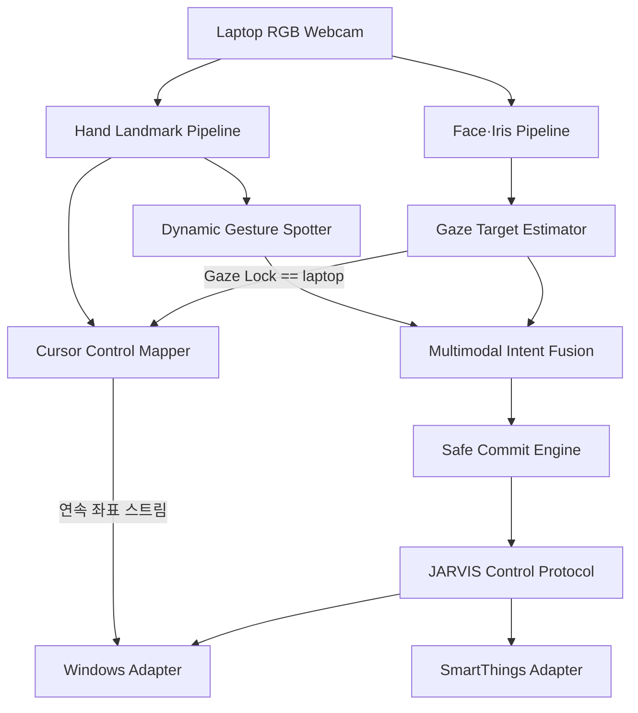

# JARVIS
몰입캠프 JARVIS 프로젝트 repository
# JARVIS 기획안 v1.0

## 시선 기반 모션 제스처 전자기기 제어 OS

> **바라보면 선택되고, 움직이면 실행된다.**
> 

---

## 목차

1. [프로젝트 개요](#1-프로젝트-개요)
2. [프로젝트 배경](#2-프로젝트-배경)
3. [핵심 문제](#3-핵심-문제)
4. [프로젝트 범위](#4-프로젝트-범위)
5. [사용자 흐름](#5-사용자-흐름)
6. [전체 시스템 구조](#6-전체-시스템-구조)
7. [핵심 기능 1: Gaze Targeting Engine](#7-핵심-기능-1-gaze-targeting-engine)
8. [핵심 기능 2: Dynamic Gesture Spotter](#8-핵심-기능-2-dynamic-gesture-spotter)
9. [핵심 기능 3: Multimodal Intent Fusion](#9-핵심-기능-3-multimodal-intent-fusion)
10. [핵심 기능 4: 전자기기 제어 프로토콜](#10-핵심-기능-4-전자기기-제어-프로토콜)
11. [전자기기 연결 방법](#11-전자기기-연결-방법)
12. [3인 역할 분담](#12-3인-역할-분담)
13. [평가 지표](#13-평가-지표)
14. [Baseline](#14-baseline)
15. [테스트 시나리오](#15-테스트-시나리오)
16. [개발 일정](#16-개발-일정)
17. [최종 산출물](#17-최종-산출물)
18. [최종 시연 구성](#18-최종-시연-구성)
19. [최종 프로젝트 소개](#19-최종-프로젝트-소개)

---

# 1. 프로젝트 개요

### 프로젝트명

**JARVIS — Gaze-Grounded Motion Control Runtime**

### 한 줄 정의

일반 노트북 웹캠으로 사용자의 시선과 손동작을 실시간 분석하여, 사용자가 바라보는 전자기기를 선택하고 손 제스처로 명령을 실행하는 멀티모달 전자기기 제어 런타임 파이프라인이다.

### 핵심 인터랙션

```
시선으로 기기 선택
→ 손 제스처로 명령 입력
→ 기기에 맞는 기능 실행
```

예를 들어 같은 `Swipe Down` 제스처라도:

- 노트북을 바라보면 페이지 스크롤
- 스마트 전구를 바라보면 밝기 감소
- TV를 바라보면 볼륨 감소 (확장)
- 에어컨을 바라보면 온도 감소 (확장)

로 해석한다.

---

# 2. 프로젝트 배경

현재 전자기기는 각각 다른 입력 장치를 사용한다.

| 전자기기 | 일반적인 조작 방식 |
| --- | --- |
| 노트북 | 키보드·마우스 |
| TV | 리모컨 |
| 에어컨 | IR 리모컨 |
| 선풍기 | 버튼·리모컨 |
| 스마트 조명 | 모바일 앱 |

JARVIS는 이러한 입력 체계를 하나의 공간 인터페이스로 통합한다.

```
무엇을 조작할 것인가? → 시선
어떤 동작을 수행할 것인가? → 손 제스처
언제 실행할 것인가? → Intent Fusion
어떻게 실행할 것인가? → Device Protocol
```

---

# 3. 핵심 문제

## 핵심 질문

> 일반 웹캠만 사용하여 사용자가 바라보는 등록 기기를 실시간으로 추정하고, 시선과 동적 손 제스처의 시간적 관계를 분석하여 잘못된 기기 실행 없이 원하는 명령을 수행할 수 있는가?
> 

단순히 눈과 손을 각각 인식하는 것이 핵심은 아니다.

JARVIS가 해결하려는 문제는 다음과 같다.

> **“사용자가 기기를 보고 있었다”와 “그 기기를 조작하려 했다”를 어떻게 구분할 것인가?**
> 

## 핵심 기술 문제

1. 웹캠 영상에서 사용자가 바라보는 기기 추정
2. 연속 영상에서 동적 제스처의 시작·종료 탐지
3. 시선과 제스처가 같은 조작 의도인지 시간적으로 판단
4. 잘못된 대상·명령·중복 실행 방지
5. 지연 없이 PC·스마트 기기로 전달

---

# 4. 프로젝트 범위

## 지원 대상

### 1차 대상: 노트북

- 마우스 컨트롤
- 스크롤
- 미디어 재생·정지
- 볼륨 조절

### 2차 대상: 전자기기

- 스마트 전구
- 스마트폰
- TV
- 에어컨
- 선풍기

## MVP 시연 범위

실제 구현은 다음 두 종류로 제한한다.

1. Windows 노트북
2. 스마트싱스 전구

“모든 전자기기”는 확장 방향이고, MVP에서는 서로 다른 제어 방식을 가진 두 종류의 기기를 하나의 코어로 제어하는 것을 증명한다.

---

# 5. 사용자 흐름

## 5.1 초기 기기 등록

```
JARVIS 실행
→ 카메라 위치 고정
→ 기기 추가
→ 1/2 자세·거리별 테두리 수집(20초)
   → 물체 테두리를 계속 훑음
   → 얼굴·몸을 대각선과 앞뒤로 이동
   → gaze/head/face scale/face center의 target 분포 수집
→ 2/2 정밀 물체 영역 확정(16초)
   → 고개·몸은 고정
   → 눈으로 왼쪽 위 모서리부터 네 변을 한 바퀴 순서대로 추적
   → 물체의 최종 각도 영역·spread 확정
→ 제어 capability 등록
```

두 단계를 모두 테두리 응시로 구성한다. 1단계는 사용자 자세·거리·카메라 안 얼굴
위치가 달라져도 같은 물체로 인식할 범위를 모으고, 2단계는 고개를 고정해 물체의
시선 영역을 더 정확하게 확정한다. 서로 다른 표면점을 향하는 테두리 ray를 한 점으로
삼각측량하면 가짜 3D 좌표가 생기므로 새 등록에서는 3D 중심을 만들지 않는다. 각
단계는 최소 30개 유효 프레임도 함께 요구하므로 눈 감김·
추적 손실이 많으면 타이머가 끝난 뒤에도 필요한 프레임을 채울 때까지 연장된다.

예:

```
[전구 등록 시작]
1/2 자세·거리별 테두리: 테두리를 훑으며 얼굴을 왼쪽 위로 이동하세요
2/2 영역 확정: 고개를 고정하고 윗변을 왼쪽→오른쪽으로 따라 보세요
전구 2단계 등록 완료 (자세별 테두리 420 frames, 정밀 테두리 335 frames)
```

## 5.2 기기 선택

```
사용자가 전구를 바라봄
→ 전구 후보 생성
→ 일정 시간 이상 시선 유지
→ 전구 Target Lock
```

## 5.3 명령 실행

```
전구 Target Lock
→ Swipe Down 수행
→ 전구의 brightness capability와 연결
→ 밝기 감소 명령
→ 정확히 한 번 실행
```

## 5.4 취소

다음 상황에서는 명령을 실행하지 않는다.

- 시선이 불안정함
- 두 기기의 선택 확률이 비슷함
- 제스처가 완성되지 않음
- 손 또는 얼굴 추적을 잃음
- Target Lock이 만료됨
- 제스처와 기기 capability가 맞지 않음

---

# 6. 전체 시스템 구조



MQTT·Home Assistant, ESP32 IR/RF adapter는 확장 방향이며 MVP에는 포함하지 않는다.

## Cursor Control Mapper

마우스 커서 조작은 이산적인 1회성 명령이 아니라 손 위치를 매 프레임 연속으로 커서 좌표에 매핑하는 동작이라, Dynamic Gesture Spotter·Multimodal Intent Fusion·Safe Commit Engine·Command dedup으로 이어지는 기존 경로를 그대로 타지 않는다. 대신:

```
Gaze Lock == laptop (게이트)
→ Hand Landmark Pipeline의 손 위치를 그대로 사용
→ 커서 좌표로 매핑
→ Windows Adapter로 직접 전달 (Intent·Command 미경유)
```

Gaze Lock은 게이트로만 남아있다 — 노트북을 보고 있지 않으면 손을 움직여도 커서가 반응하지 않는다. Target Lock이 풀리는 즉시(예: 시선이 다른 기기로 이동) 이 분기도 즉시 종료되어야 하며, Intent Commit 같은 TTL·중복 방지 로직은 적용되지 않는다(연속 스트림이므로 "중복 실행"이라는 개념 자체가 없다).

### 커서 모드 ↔ 제스처 모드 분기

노트북 Lock 상태에서는 같은 손 스트림이 커서 조작과 이산 제스처 양쪽에 쓰일 수 있으므로 다음 규칙으로 분기한다.

```
기본 상태: 커서 모드 (손 위치 → 커서 좌표)
→ Gesture Spotter가 ONSET 감지: 커서 스트림 일시정지, 제스처 판정 우선
→ 제스처 완료(ENDING → commit): 이산 명령 실행 후 커서 모드 복귀
→ 제스처 불성립(IDLE 복귀): 즉시 커서 모드 복귀
```

별도의 모드 전환 동작 없이 자연스럽게 이어지는 대신, 제스처 시작 순간 커서가 미세하게 끌릴 수 있는 것은 감수한다(2026-07-18 결정, [decisions.md](documents/decisions.md)).

---

# 7. 핵심 기능 1: Gaze Targeting Engine

## 목적

사용자가 바라보는 등록 기기를 선택한다.

## 입력 정보

- 양쪽 홍채 위치
- 눈 양 끝점
- 얼굴 랜드마크
- 머리 yaw·pitch·roll
- 얼굴 transformation matrix
- 눈·얼굴 tracking confidence

MediaPipe Face Landmarker는 얼굴 랜드마크와 얼굴 transformation matrix를 제공하지만 바라보는 실제 대상을 직접 알려주지는 않는다. 따라서 JARVIS가 별도의 사용자별 calibration과 target classifier를 구현해야 한다.

## 시선 방향 벡터 합성

머리 yaw/pitch와 눈동자 오프셋을 별도 feature로 이어붙이지 않는다. 등록 시(고개를 돌려서 봄)와 실사용 시(고개는 그대로, 눈짓만 함)의 머리·눈 조합 비율이 다르기 때문에, 두 값을 따로 저장하면 같은 곳을 보고 있어도 등록 때와 다른 벡터가 나와 매칭에 실패한다.

대신 머리 회전과 눈-머리 상대 오프셋을 합성해 **하나의 시선 방향 단위 벡터**로 만든다.

```
시선 방향 벡터 = 머리 회전(yaw, pitch) ⊕ 눈-머리 상대 오프셋
```

합성 벡터는 물체 영역의 1차 좌표다. 다만 실제 단안 landmark에서는 자세에 따라
오차가 달라지므로, 최종 판정은 합성 벡터만 쓰지 않고 head pose·face scale·카메라
안 face center를 함께 저장한 8차원 target 분포로 보완한다.

## 입력 신호 → 시선 방향 벡터

```
왼쪽 홍채 상대 위치
오른쪽 홍채 상대 위치
머리 yaw
머리 pitch
머리 roll
얼굴 위치
눈 추적 confidence
```

위 신호로 만든 시선 방향 벡터를 1차 영역 판정에 사용하고, 최종 target 순위에는
`[gaze yaw/pitch, head yaw/pitch/roll, face scale, face center x/y]` 8차원 등록
분포를 함께 사용한다. 별도 MLP·Linear-softmax 학습은 없으며 등록 프레임의 평균·
공분산과 Mahalanobis distance만 계산한다.

## 현재 구현 튜닝값 (2026-07-21)

현재 데모/디버깅 기준값은 `src/jarvis/gaze/config.py`가 단일 기준이다.

| 항목 | 현재값 | 의미 |
| --- | ---: | --- |
| `max_eye_offset_deg` | `45.0` | 홍채 상대 위치 `-1..1`을 눈 회전각으로 환산할 때의 최대 각도 |
| `head_yaw_weight` | `0.25` | head yaw가 최종 gaze yaw에 들어가는 비중 |
| `head_pitch_weight` | `0.40` | head pitch가 최종 gaze pitch에 들어가는 비중 |
| `horizontal_axis_sign` | `-1.0` | 카메라 좌우/사용자 좌우 방향 보정 |
| `head_only_confidence_scale` | `0.45` | 눈을 못 쓸 때 head-only gaze confidence 배율 |
| `smoothing_window_frames` | `8` | confidence 가중 이동 평균에 쓰는 최근 프레임 수 |
| `ema_min_alpha` / `ema_max_alpha` | `0.15` / `0.65` | 낮은/높은 confidence 프레임의 EMA 반영률 |
| `blink_hold_ms` | `300` | 짧은 눈 감김 동안 마지막 안정 gaze 유지 시간 |
| `blink_recovery_hold_ms` | `250` | 눈을 다시 뜬 직후 홍채 landmark 안정화 hold 시간 |
| `tracking_loss_hold_ms` | `800` | 실제 얼굴 landmark 손실 동안 마지막 gaze를 유지하는 시간 |
| `eye_closed_ratio_threshold` | `0.12` | 눈꺼풀 높이/눈 너비의 절대 눈 감김 하한 |
| `blink_close_ratio` / `blink_reopen_ratio` | `0.68` / `0.82` | 사용자별 평소 눈 뜬 높이에 대한 감김/재개방 hysteresis 비율 |
| `eye_openness_baseline_decay` | `0.01` | 자세 변화에 맞춰 평소 눈 뜬 높이를 천천히 낮추는 프레임당 비율 |
| `iris_jump_threshold` | `0.18` | 프레임 간 홍채 offset jump 감지 기준 |
| `max_valid_eye_offset` | `0.55` | 비현실적인 눈 가장자리 홍채 offset reject 기준 |
| `small_motion_deadzone_deg` | `1.0` | 미세한 smoothed gaze 흔들림만 흡수하는 각도 |
| `target_context_tolerance` | `1.35` | 테두리 안 후보의 8D Mahalanobis soft-context 점수 스케일 |
| `target_settle_alignment_weight` | `0.55` | 겹친 영역에서 마지막 홍채 감속 방향에 주는 최대 보너스 |
| `gaze_settle_start_speed_deg_s` | `12.0` | 홍채 이동을 시작으로 간주하는 각속도 |
| `gaze_settle_stop_speed_deg_s` | `4.0` | 홍채가 멈췄다고 간주하는 각속도 |
| `gaze_settle_memory_ms` | `500` | 마지막 감속 방향을 겹침 판정에 유지하는 시간 |
| `gaze_motion_max_interval_ms` | `250` | blink/추적 공백 뒤 잘못된 속도·가속도를 막는 최대 차분 간격 |
| `unknown_probability_threshold` | `0.80` | target top-1 확률이 낮을 때 `UNKNOWN` reject |
| `unknown_max_angle_deg` | `25.0` | 가장 가까운 등록 방향과도 너무 멀 때 `UNKNOWN` reject |
| `target_match_tolerance` | `1.10` | 등록 반경 경계값을 살짝 넘는 gaze를 허용하는 정규화 거리 상한 |
| `registration_min_spread_deg` / `registration_max_spread_deg` | `4.0` / `8.0` | 등록 target의 각도 profile spread 하한/상한 |
| `registration_max_area_radius_deg` | `6.0` | edge-loop target area가 과하게 커졌을 때 런타임에서 적용하는 반경 cap |

`TRACKING LOST`는 MediaPipe가 얼굴 landmark를 반환하지 않은 경우에만 표시한다.
얼굴은 검출됐지만 blink/recovery로 홍채를 잠시 못 쓰면 300ms 동안 마지막 gaze를
유지하고, 안정된 이전 gaze가 없거나 hold가 끝나면 confidence `0.45`의 head-only
벡터로 전환한다. 디버깅 화면의 `gaze source`가 `head+iris`, `held`, `head-only`,
`tracking-hold`, `tracking-lost` 중 현재 경로를 표시한다.

정확도 문제는 실시간 탭의 라벨된 진단 세션으로 재현한다. F9로 녹화를 시작하고
`0`(응시 대상 없음) 또는 `1`~`9`(등록 순서의 target)로 실제 정답을 표시한 뒤
F9로 끝내면, 앱 안에 head pose·얼굴 위치·등록 대비 얼굴 크기별 정확도와 대표
실패 프레임이 자동으로 표시된다. 세션 숫자값은 `data/diagnostics/session_*.jsonl`
에 저장되며 이미지 프레임은 저장하지 않는다. CLI에서는
`jarvis-gaze report <session.jsonl>`로 같은 분석을 다시 볼 수 있다.

실험 중 조정 우선순위는 다음과 같다.

1. 위/아래 고개 움직임이 덜 반영되면 `head_pitch_weight`를 조정한다.
2. 좌/우 고개 움직임이 과하거나 부족하면 `head_yaw_weight`를 조정한다.
3. 겹친 후보가 자세·거리 문맥과 다르게 선택되면 `target_context_tolerance`를 조정한다.
4. 경계에서만 `UNKNOWN`이면 `target_match_tolerance`를 조금 올린다.
5. 겹친 물체가 반대로 선택되면 settle start/stop 속도와 `target_settle_alignment_weight`를 조정한다.
6. 안 보고 있는데 target으로 빨려 들어가면 `registration_max_area_radius_deg`를 낮추거나 다시 등록한다.

## 기기 등록 방식

기기 등록은 자세·거리별 테두리 20초와 정밀 테두리 16초의 두 단계로 나뉜다.
1단계에서는 테두리를 훑는 동안 얼굴·몸을 네 대각선과 앞뒤로 움직여 gaze/head/
face scale/face center가 함께 변하는 분포를 수집한다. 2단계에서는 고개를 고정한
채 눈으로 네 변을 순서대로 훑어 최종 yaw/pitch 영역을 확정한다. 두 단계의 유효
프레임은 8차원 target feature profile에 함께 들어가며, 2단계 경계의 중앙값이
target 중심이 된다. 프레임 이미지는 저장하지 않고 숫자 feature의 평균·공분산만
JSON에 저장한다. 2단계 경계 샘플은 95퍼센타일 밖의 jump/outlier를 제외한 뒤
convex hull로 축약한다. 따라서 사각 물체의 모서리를 타원처럼 잘라내지 않고,
hull 내부 전체를 물체 영역으로 판정한다.

```
{
  "device_id":"room.bulb",
  "gaze_profile": {
    "mean_direction": [0.12,-0.04,0.99],
    "variance": 0.015
  },
  "feature_profile": {
    "mean": [1.2, 4.0, -3.0, 6.0, 0.5, 0.09, 0.51, 0.43],
    "covariance": [["8 x 8 covariance"]],
    "threshold": 2.5
  },
  "area_profile": {
    "center_yaw": -2.8,
    "center_pitch": 7.4,
    "radius_yaw": 6.0,
    "radius_pitch": 4.0,
    "boundary_polygon": [[-8.8,3.4],[3.2,3.4],[3.2,11.4],[-8.8,11.4]]
  }
}
```

기존 JSON의 `position_3d`는 하위 호환으로 읽을 수 있지만 새 테두리 등록에서는 만들지
않는다. 테두리 ray는 서로 다른 표면점을 향하므로 한 점으로 삼각측량할 수 없기 때문이다.

## Target 추정

Baseline:

```
현재 시선 방향 벡터
→ 각 기기 prototype 방향 벡터와 코사인 유사도(내적) 비교
→ 유사도가 가장 높은 기기 선택
```

최종 방식:

```
최근 시선 방향 시퀀스
→ Temporal smoothing
→ 정밀 테두리 convex hull 안 target만 후보 생성
→ 8D Mahalanobis 문맥(gaze/head/scale/face center)으로 후보 순위·신뢰도 조정
→ 겹친 후보는 gaze 중심 점수 + 홍채 settle 방향으로 결정
→ area 밖이면 UNKNOWN
```

polygon 정규화 거리는 target 중심에서 현재 gaze 방향으로 ray를 뻗어 hull 경계와
만나는 지점을 `1.0`으로 둔다. `target_match_tolerance=1.10`은 이 경계를 방사형으로
10% 넘는 작은 측정 오차까지만 허용한다. `boundary_polygon`이 없는 과거 JSON은
하위 호환을 위해 기존 타원 거리로 읽으며, 실제 hull을 사용하려면 위치를 다시 등록한다.

`position_3d`가 등록된 기기는 Device classifier 단계에서 "유사도"를 다르게
얻는다 — 등록 시 저장한 고정 방향과 비교하는 대신, 현재 머리 위치에서 그
물체 중심까지의 방향을 매 프레임 새로 계산해 비교한다(머리가 등록 때와 다른
곳으로 옮겨가도 정확하게 맞는다). 반경은 그 거리에서의 각도 크기
(`atan(반경/거리)`)로 환산해 분산 대신 쓴다. 이렇게 하면 3D 등록·각도 등록
기기가 섞여 있어도 같은 Unknown rejection 로직 하나로 처리된다. 이번
프레임에 머리 위치를 못 구했거나(추적 손실 등) 물체에 `position_3d`가 없으면
그 기기는 항상 기존 방향+분산 방식으로 비교된다.

출력:

```
{
  "target":"room.bulb",
  "probability":0.87,
  "second_best_probability":0.13,
  "stability":0.91
}
```

MLP·Ridge·Linear-softmax 모델은 사용하지 않는다. 겹침 tie-break는 홍채가 빠르게
이동한 뒤 정지 임계값 아래로 감속할 때 마지막 유효 속도 방향을 저장해 사용한다.
가속도는 감속 시 이동 반대를 가리킬 수 있어 target 보너스에 쓰지 않는다. blink,
recovery, iris jump, 추적 손실 프레임은 settle history를 즉시 초기화한다.

## Gaze Lock 상태 머신

```
SEARCHING
→ CANDIDATE
→ TARGET_LOCKED
→ GESTURE_WAIT
→ EXPIRED 또는 COMMITTED
```

초기 기준:

```
dwell_time_ms: 3000
minimum_probability: 0.80
minimum_margin: 0.20
target_lock_ttl_ms: 1500
confirmed_unknown_timeout_ms: 2000
```

기기가 Lock되면 마지막 확정 선택을 유지한다. 다른 기기를 보기 시작해도 기존 기기를
즉시 해제하지 않고 새 기기의 3초 dwell을 별도 후보로 누적하며, 3초를 모두 채운 한
프레임에서만 선택을 원자적으로 교체한다. 후보가 도중에 `UNKNOWN` 또는 저신뢰로
취소되면 이전 확정 기기를 즉시 버리지 않는다. 다만 Gaze 엔진 결과가 2초 동안
연속으로 `UNKNOWN`이면 사용자가 등록 영역을 벗어난 것으로 보고 확정 기기도
`UNKNOWN`으로 해제한다. 2초 안에 알려진 target이 다시 나오면 타이머는 초기화된다.
확정 기기 삭제·명시적 reset과 `GESTURE_WAIT`의 TTL 만료도 별도로 처리한다.

---

# 8. 핵심 기능 2: Dynamic Gesture Spotter

## 목적

끊기지 않는 웹캠 영상에서 사전에 정의된 동적 제스처의 시작과 종료를 실시간으로 찾는다.

## 지원 제스처

- Swipe Up
- Swipe Down
- Swipe Left
- Swipe Right
- Rotate Clockwise
- Rotate Counter-clockwise
- Pinch 또는 주먹은 확장 기능

## 처리 과정

```
MediaPipe Hand Landmark
→ 손목 기준 좌표 정규화
→ 손바닥 크기 정규화
→ 속도·관절 각도 생성
→ Causal TCN/GRU
→ Gesture·Phase 출력
```

## 모델 출력

```
Gesture:
swipe_down 0.92

Phase:
ENDING 0.88

Uncertainty:
0.07
```

Phase 종류:

```
IDLE
ONSET
ACTIVE
ENDING
```

제스처가 여러 프레임에서 검출되더라도 `ENDING`과 상태 머신을 이용해 하나의 이벤트로 만든다.

---

# 9. 핵심 기능 3: Multimodal Intent Fusion

## 목적

시선과 손동작이 동일한 사용자 명령에 속하는지 판단한다.

## Intent 상태 머신

```
IDLE
→ TARGET_CANDIDATE
→ TARGET_LOCKED
→ GESTURE_TRACKING
→ INTENT_CANDIDATE
→ COMMITTED
→ COOLDOWN
```

## Commit 조건

다음 조건을 모두 만족해야 한다.

1. 등록된 기기 하나가 Lock됨
2. Target Lock 이후 제스처가 시작됨
3. Target Lock TTL 안에 제스처가 완료됨
4. Target confidence 기준 충족
5. Gesture confidence 기준 충족
6. 시선과 제스처의 시간 관계가 유효함
7. 동일 이벤트가 이전에 실행되지 않음

## 결합 점수

```
S = P(target) × P(gesture) × gaze_stability × (1 − uncertainty)
```

```python
if (target_locked
    and gesture_ended
    and fusion_score >= commit_threshold
    and not already_committed):
    commit_intent()
```

## Intent 예시

```
{
  "intent_id":"intent-1042",
  "target":"room.bulb",
  "gesture":"swipe_down",
  "capability":"brightness",
  "operation":"decrement",
  "value":1,
  "target_confidence":0.87,
  "gesture_confidence":0.92,
  "expires_in_ms":1000
}
```

---

# 10. 핵심 기능 4: 전자기기 제어 프로토콜

## Device Capability Model

전자기기를 제조사 이름이 아니라 지원 기능으로 표현한다.

```
{
  "device_id":"room.bulb",
  "adapter":"smartthings",
  "capabilities": {
    "power": {
      "type":"boolean"
    },
    "brightness": {
      "type":"number",
      "min":0,
      "max":100,
      "step":10
    },
    "color_temperature": {
      "type":"number",
      "min":2700,
      "max":6500,
      "step":100
    }
  }
}
```

## 명령 상태

```
CREATED
→ VALIDATED
→ DISPATCHED
→ ACKNOWLEDGED
→ VERIFIED
```

실패 상태:

```
REJECTED
EXPIRED
FAILED
UNVERIFIED
```

실제 상태 확인이 어려운 기기(예: 확장 방향의 IR 기기)는 `UNVERIFIED`로 구분한다.

## 중복 실행 방지

모든 명령에 고유 ID를 부여한다.

```
{
  "command_id":"command-3901",
  "intent_id":"intent-1042",
  "expires_at":1939401300
}
```

동일한 `command_id`는 두 번 실행하지 않는다.

---

# 11. 전자기기 연결 방법

MVP에서 실제로 연결하는 기기는 다음 두 가지다.

| 대상 | 연결 방식 | 추가 장치 |
| --- | --- | --- |
| Windows 노트북 | Win32 API | 없음 |
| 스마트싱스 전구 | SmartThings API | 제품에 따라 Hub |

확장 방향의 기기는 다음과 같이 연결할 수 있다.

| 대상 | 연결 방식 | 추가 장치 |
| --- | --- | --- |
| 스마트 조명·플러그 | Home Assistant·MQTT | 제품에 따라 Hub |
| 스마트 TV | LAN API·Home Assistant | 없음 또는 Hub |
| 일반 TV·에어컨 | IR | ESP32+IR LED |
| RF 선풍기 | 433MHz RF | ESP32+RF 모듈 |

별도 시선·모션 센서는 필요하지 않지만, 구형 가전의 리모컨 신호를 대신 전송하려면 IR/RF Bridge가 필요하다.

---

# 12. 3인 역할 분담

## 1인 — Gaze Targeting

- Face·iris landmark
- head pose
- gaze feature 정규화
- 기기별 calibration
- target classifier
- `UNKNOWN` rejection
- gaze smoothing
- Gaze Lock
- Target Selection Accuracy 평가

## 2인 — Gesture & Intent Fusion

- Hand landmark
- 동적 gesture spotting
- Causal TCN/GRU
- gesture phase
- 시선·제스처 temporal alignment
- fusion confidence
- safe commit
- duplicate intent 방지
- hard-negative mining

## 3인 — Runtime & Device Protocol

- 카메라 멀티스트림 pipeline
- timestamp 동기화
- bounded queue
- device capability model
- Windows adapter
- SmartThings adapter
- 명령 timeout·ACK·deduplication
- End-to-End latency 측정

세 명 모두 핵심 로직을 맡고 UI 전담자는 두지 않는다.

---

# 13. 평가 지표

## 핵심 지표 1: Wrong Actuation Rate

다음을 모두 잘못된 실행으로 계산한다.

- 잘못된 기기 선택
- 잘못된 제스처 실행
- 시선만으로 실행
- Target Lock 만료 후 실행
- 동일 명령 중복 실행

```
WAR = 잘못 실행된 명령 수 / 전체 명령 시도 수
```

목표:

```
Wrong Actuation Rate ≤ 1%
```

## 핵심 지표 2: End-to-End p95 Latency

```
제스처 판정에 필요한 마지막 프레임
→ Intent Commit
→ 실제 기기 명령 실행
```

목표:

```
노트북 p95 ≤ 150ms
스마트싱스 전구 p95 ≤ 1000ms
```

전구는 SmartThings 클라우드 API를 경유하므로 노트북과 같은 기준을 적용할 수 없다. 대신 Intent Commit까지의 내부 지연(프레임 → Commit)은 두 기기 모두 150ms 기준을 공유하고, 이후 네트워크 구간만 분리해 측정한다.

## 필수 제약

```
Target Selection Accuracy ≥ 90%
Gesture Event Recall ≥ 90%
Duplicate Actuation = 0
```

---

# 14. Baseline

| 방식 | 시선 | 손동작 | 시간적 결합 |
| --- | --- | --- | --- |
| Head Pose Only | 머리 방향 | O | X |
| Iris Only | 눈동자 | O | X |
| Gaze Dwell | 눈+머리 | X | dwell만 사용 |
| Naive Fusion | 눈+머리 | O | 고정 시간 범위 |
| JARVIS | 보정된 Gaze | 동적 Spotting | Fusion state machine |

Ablation을 통해 다음 요소의 기여를 확인한다.

- 홍채 정보
- 머리 방향
- dwell
- Target Lock
- 손동작 확인
- Unknown rejection
- 중복 실행 방지

---

# 15. 테스트 시나리오

## 정상 명령

- 노트북 응시 후 Swipe Down (스크롤)
- 전구 응시 후 Swipe Down (밝기 감소)
- 노트북 응시 후 Swipe Left (창 전환)
- 전구 응시 후 Rotate (색온도 조절)

## 오작동 테스트

- 전구를 바라보지만 제스처하지 않음
- 제스처하지만 아무 기기도 바라보지 않음
- 한 기기를 보다가 다른 기기로 시선 이동
- 기기를 보면서 물 마시기
- 노트북을 보면서 머리 정리
- 제스처 도중 얼굴이 카메라에서 사라짐
- 제스처 도중 손 추적을 잃음
- 동일 명령 패킷을 두 번 전송
- Target Lock 만료 후 제스처 수행

## 환경 변화

- 밝은 환경과 어두운 환경
- 안경 착용
- 카메라와 거리 변화
- 머리만 움직이기
- 눈동자만 움직이기
- 기기 간 각도 변화

---

# 16. 개발 일정

| 날짜 | Gaze | Gesture·Fusion | Runtime·Protocol |
| --- | --- | --- | --- |
| Day 1 | 얼굴·홍채 추적 | 손 추적 baseline | PC 명령 실행 |
| Day 2 | 기기 calibration | Swipe 규칙 모델 | SmartThings 연결 |
| Day 3 | Target classifier | Causal TCN/GRU | capability model |
| Day 4 | Gaze Lock | temporal fusion | 전체 pipeline |
| Day 5 | Unknown rejection | safe commit | timeout·dedup |
| Day 6 | 환경 변화 평가 | hard-negative 평가 | latency·장애 테스트 |
| Day 7 | 통합·시연 | 통합·시연 | 통합·시연 |

---

# 17. 최종 산출물

- Gaze Targeting Engine
- Continuous Gesture Spotter
- Multimodal Intent Fusion Engine
- JARVIS Control Protocol
- Windows Adapter
- SmartThings Adapter
- Calibration Tool
- Trace Replay·Benchmark Tool
- Baseline 및 Ablation 결과
- 최소 모니터링 화면

---

# 18. 최종 시연 구성

1. 노트북·전구 위치 등록
2. 전구를 바라보며 Target Lock
3. Swipe Down으로 전구 밝기 감소
4. 노트북을 바라보며 같은 제스처 수행
5. 노트북 페이지 스크롤
6. 아무 기기도 보지 않고 제스처 수행
7. 명령 실행되지 않음
8. 전구를 보면서 물을 마심
9. 명령 실행되지 않음
10. 네트워크 지연·중복 패킷 주입
11. 오래되거나 중복된 명령 차단
12. Wrong Actuation과 p95 latency 결과 출력

---

# 19. 최종 프로젝트 소개

> JARVIS는 일반 RGB 웹캠을 통해 사용자의 시선과 손동작을 동시에 분석하고, 바라보는 전자기기를 선택한 뒤 동적 제스처로 명령을 확정하는 멀티모달 제어 런타임이다. 시선과 손동작을 독립적으로 인식하는 데 그치지 않고, 두 신호의 불확실성과 시간적 관계를 결합하여 사용자가 의도한 대상에만 명령을 정확히 한 번 실행하는 것을 핵심 문제로 다룬다.
> 

이 프로젝트의 핵심은 다음 한 문장으로 정리할 수 있다.

> **무엇을 바라봤는지가 아니라, 무엇을 조작하려 했는지를 판단한다.**
>
