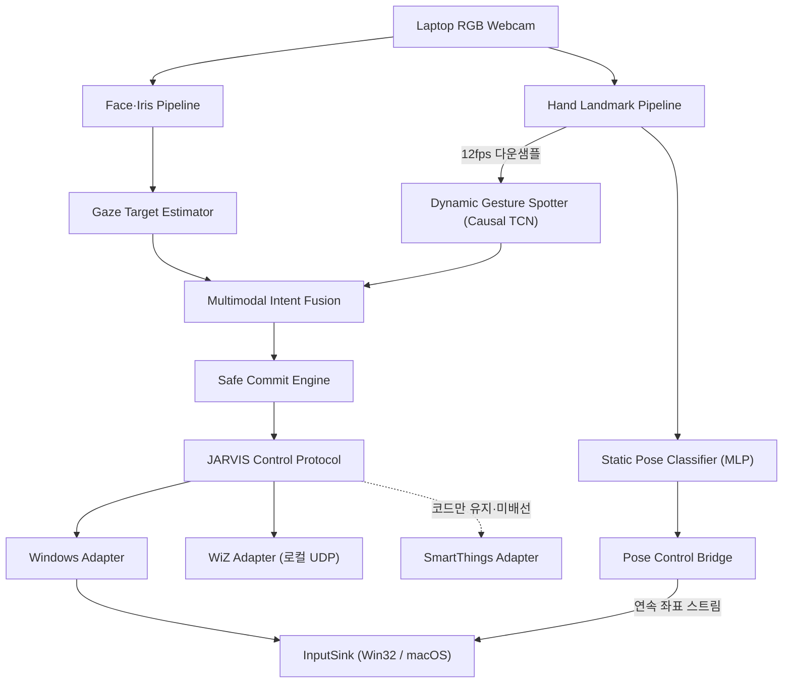

# JARVIS
몰입캠프 JARVIS 프로젝트 repository
# JARVIS 기획안 v1.0

## 시선 기반 모션 제스처 전자기기 제어 OS

> **바라보면 선택되고, 움직이면 실행된다.**
> 

---

## 목차

1. [프로젝트 개요](#1-프로젝트-개요)
2. [프로젝트 배경](#2-프로젝트-배경)
3. [핵심 문제](#3-핵심-문제)
4. [프로젝트 범위](#4-프로젝트-범위)
5. [사용자 흐름](#5-사용자-흐름)
6. [전체 시스템 구조](#6-전체-시스템-구조)
7. [핵심 기능 1: Gaze Targeting Engine](#7-핵심-기능-1-gaze-targeting-engine)
8. [핵심 기능 2: Dynamic Gesture Spotter](#8-핵심-기능-2-dynamic-gesture-spotter)
9. [핵심 기능 3: Multimodal Intent Fusion](#9-핵심-기능-3-multimodal-intent-fusion)
10. [핵심 기능 4: 전자기기 제어 프로토콜](#10-핵심-기능-4-전자기기-제어-프로토콜)
11. [전자기기 연결 방법](#11-전자기기-연결-방법)
12. [개발·디버깅 도구](#12-개발디버깅-도구)
13. [제스처 학습 파이프라인](#13-제스처-학습-파이프라인)
14. [3인 역할 분담](#14-3인-역할-분담)
15. [평가 지표](#15-평가-지표)
16. [Baseline](#16-baseline)
17. [테스트 시나리오](#17-테스트-시나리오)
18. [개발 일정](#18-개발-일정)
19. [최종 산출물](#19-최종-산출물)
20. [최종 시연 구성](#20-최종-시연-구성)
21. [최종 프로젝트 소개](#21-최종-프로젝트-소개)

---

# 1. 프로젝트 개요

### 프로젝트명

**JARVIS — Gaze-Grounded Motion Control Runtime**

### 한 줄 정의

일반 노트북 웹캠으로 사용자의 시선과 손동작을 실시간 분석하여, 사용자가 바라보는 전자기기를 선택하고 손 제스처로 명령을 실행하는 멀티모달 전자기기 제어 런타임 파이프라인이다.

### 핵심 인터랙션

```
시선으로 기기 선택
→ 손 제스처로 명령 입력
→ 기기에 맞는 기능 실행
```

예를 들어 같은 **두 손가락 아래 슬라이드**(`slide_two_fingers_down`) 제스처라도:

- 노트북을 바라보면 페이지 스크롤
- 스마트 전구를 바라보면 밝기 감소
- TV를 바라보면 볼륨 감소 (확장)
- 에어컨을 바라보면 온도 감소 (확장)

로 해석한다.

---

# 2. 프로젝트 배경

현재 전자기기는 각각 다른 입력 장치를 사용한다.

| 전자기기 | 일반적인 조작 방식 |
| --- | --- |
| 노트북 | 키보드·마우스 |
| TV | 리모컨 |
| 에어컨 | IR 리모컨 |
| 선풍기 | 버튼·리모컨 |
| 스마트 조명 | 모바일 앱 |

JARVIS는 이러한 입력 체계를 하나의 공간 인터페이스로 통합한다.

```
무엇을 조작할 것인가? → 시선
어떤 동작을 수행할 것인가? → 손 제스처
언제 실행할 것인가? → Intent Fusion
어떻게 실행할 것인가? → Device Protocol
```

---

# 3. 핵심 문제

## 핵심 질문

> 일반 웹캠만 사용하여 사용자가 바라보는 등록 기기를 실시간으로 추정하고, 시선과 동적 손 제스처의 시간적 관계를 분석하여 잘못된 기기 실행 없이 원하는 명령을 수행할 수 있는가?
> 

단순히 눈과 손을 각각 인식하는 것이 핵심은 아니다.

JARVIS가 해결하려는 문제는 다음과 같다.

> **“사용자가 기기를 보고 있었다”와 “그 기기를 조작하려 했다”를 어떻게 구분할 것인가?**
> 

## 핵심 기술 문제

1. 웹캠 영상에서 사용자가 바라보는 기기 추정
2. 연속 영상에서 동적 제스처의 시작·종료 탐지
3. 시선과 제스처가 같은 조작 의도인지 시간적으로 판단
4. 잘못된 대상·명령·중복 실행 방지
5. 지연 없이 PC·스마트 기기로 전달

---

# 4. 프로젝트 범위

## 지원 대상

### 1차 대상: 노트북

- 마우스 컨트롤
- 스크롤
- 미디어 재생·정지
- 볼륨 조절

### 2차 대상: 전자기기

- 스마트 전구
- 스마트폰
- TV
- 에어컨
- 선풍기

## MVP 시연 범위

실제 구현은 다음 두 종류로 제한한다.

1. Windows/macOS 노트북 (로컬 입력 합성)
2. 스마트 전구 — **실제 데모는 Philips WiZ(로컬 UDP 직접 제어)로 구현**했다. SmartThings adapter(클라우드 API)도 같은 `DeviceAdapter` 계약으로 코드에 남아 있으나, 데모 당일 클라우드 왕복·전구 UUID 확보 리스크를 피해 같은 LAN에서 토큰 없이 제어되는 WiZ를 실행 백엔드로 택했다. 현재 `room.bulb` 프로파일의 `adapter`가 `"wiz"`로 고정돼 있어 SmartThings는 **환경변수만으로는 활성화되지 않는다** — 쓰려면 `runtime/devices.py`의 프로파일을 함께 바꿔야 한다(documents/decisions.md·runtime-protocol.md 참조).

“모든 전자기기”는 확장 방향이고, MVP에서는 서로 다른 제어 방식을 가진 두 종류의 기기를 하나의 코어로 제어하는 것을 증명한다.

---

# 5. 사용자 흐름

## 5.1 초기 기기 등록

```
JARVIS 실행
→ 카메라 위치 고정
→ 기기 추가
→ 1/2 자세·거리별 테두리 수집(20초)
   → 물체 테두리를 계속 훑음
   → 얼굴·몸을 대각선과 앞뒤로 이동
   → gaze/head/face scale/face center의 target 분포 수집
→ 2/2 정밀 물체 영역 확정(16초)
   → 고개·몸은 고정
   → 눈으로 왼쪽 위 모서리부터 네 변을 한 바퀴 순서대로 추적
   → 물체의 최종 각도 영역·spread 확정
→ 제어 capability 등록
```

두 단계를 모두 테두리 응시로 구성한다. 1단계는 사용자 자세·거리·카메라 안 얼굴
위치가 달라져도 같은 물체로 인식할 범위를 모으고, 2단계는 고개를 고정해 물체의
시선 영역을 더 정확하게 확정한다. 서로 다른 표면점을 향하는 테두리 ray를 한 점으로
삼각측량하면 가짜 3D 좌표가 생기므로 새 등록에서는 3D 중심을 만들지 않는다. 각
단계는 최소 30개 유효 프레임도 함께 요구하므로 눈 감김·
추적 손실이 많으면 타이머가 끝난 뒤에도 필요한 프레임을 채울 때까지 연장된다.

예:

```
[전구 등록 시작]
1/2 자세·거리별 테두리: 테두리를 훑으며 얼굴을 왼쪽 위로 이동하세요
2/2 영역 확정: 고개를 고정하고 윗변을 왼쪽→오른쪽으로 따라 보세요
전구 2단계 등록 완료 (자세별 테두리 420 frames, 정밀 테두리 335 frames)
```

## 5.2 기기 선택

```
사용자가 전구를 바라봄
→ 전구 후보 생성
→ 일정 시간 이상 시선 유지
→ 전구 Target Lock
```

## 5.3 명령 실행

```
전구 Target Lock
→ 두 손가락 아래 슬라이드(slide_two_fingers_down) 수행
→ 전구의 brightness capability와 연결
→ 밝기 감소 명령(-30)
→ 정확히 한 번 실행
```

## 5.4 취소

다음 상황에서는 명령을 실행하지 않는다.

- 시선이 불안정함
- 두 기기의 선택 확률이 비슷함
- 제스처가 완성되지 않음
- 손 또는 얼굴 추적을 잃음
- Target Lock이 만료됨
- 제스처와 기기 capability가 맞지 않음

---

# 6. 전체 시스템 구조



MQTT·Home Assistant, ESP32 IR/RF adapter는 확장 방향이며 MVP에는 포함하지 않는다.

손 스트림은 **두 개의 독립된 경로**로 갈라진다. 동적 제스처(슬라이드·회전)는 12fps로 솎아 Causal TCN → Fusion → Intent → Protocol을 타고, 커서·클릭·스크롤 같은 **정적 손 모양**은 별도 MLP 분류기와 시간축 상태기계를 거쳐 OS 입력으로 직접 나간다. 두 모델은 서로를 import하지 않고 입력 차원·산출물이 다르다([gesture-fusion.md](documents/gesture-fusion.md)).

## Pose Control Bridge (커서·클릭·스크롤)

마우스 커서 조작은 이산적인 1회성 명령이 아니라 손 모양을 매 프레임 판정해 연속으로 반영하는 동작이라, Intent·Command·dedup 경로를 타지 않는다. `PoseControlBridge`가 `InputSink`(Win32 `user32` / macOS Quartz)를 **직접** 호출하며 `WindowsAdapter`를 경유하지 않는다.

억제 규칙은 "노트북을 볼 때만 켠다"가 아니라 **"노트북이 아닌 기기에 lock됐을 때만 끈다"**는 반대 방향의 게이트다.

```
기본: 커서 제어 활성 (아무것도 lock되지 않아도 동작)
→ 노트북이 아닌 기기(전구)에 Target Lock: 커서 억제
   (전구를 보며 손을 움직일 때 커서가 따라가지 않도록)
→ 시연 탭이 활성: 커서 억제
   (같은 슬라이드가 pose 스크롤 + Intent 스크롤로 이중 실행되는 것 방지)
→ "손동작으로 컴퓨터 제어" 토글 OFF: 커서·클릭 정지
   + 노트북 대상 Intent 명령도 함께 차단(2026-07-22)
```

즉 시선이 어디에도 lock되지 않은 상태에서는 커서가 그대로 살아 있다. Target Lock은 "노트북일 때만 허용하는 양성 게이트"가 아니라 "다른 기기를 볼 때 비켜주는 음성 게이트"로 구현돼 있다.

지원 동작: 커서 이동(`index_point`), 클릭·드래그·더블클릭(`pinch_index`), 우클릭(`pinch_middle`), 스크롤(`two_fingers`가 가리키는 방향), 탭 닫기(`middle_point`, dwell 500ms), 주먹→보 전이로 Task View(Windows)·Mission Control(macOS), 검지 회전으로 볼륨 조절. 상세는 [gesture-fusion.md](documents/gesture-fusion.md) "정적 손 자세 파이프라인" 참조.

---

# 7. 핵심 기능 1: Gaze Targeting Engine

## 목적

사용자가 바라보는 등록 기기를 선택한다.

## 입력 정보

- 양쪽 홍채 위치
- 눈 양 끝점
- 얼굴 랜드마크
- 머리 yaw·pitch·roll
- 얼굴 transformation matrix
- 눈·얼굴 tracking confidence

MediaPipe Face Landmarker는 얼굴 랜드마크와 얼굴 transformation matrix를 제공하지만 바라보는 실제 대상을 직접 알려주지는 않는다. 따라서 JARVIS가 별도의 사용자별 calibration과 target classifier를 구현해야 한다.

## 시선 방향 벡터 합성

머리 yaw/pitch와 눈동자 오프셋을 별도 feature로 이어붙이지 않는다. 등록 시(고개를 돌려서 봄)와 실사용 시(고개는 그대로, 눈짓만 함)의 머리·눈 조합 비율이 다르기 때문에, 두 값을 따로 저장하면 같은 곳을 보고 있어도 등록 때와 다른 벡터가 나와 매칭에 실패한다.

대신 머리 회전과 눈-머리 상대 오프셋을 합성해 **하나의 시선 방향 단위 벡터**로 만든다.

```
시선 방향 벡터 = 머리 회전(yaw, pitch) ⊕ 눈-머리 상대 오프셋
```

합성 벡터는 물체 영역의 1차 좌표다. 다만 실제 단안 landmark에서는 자세에 따라
오차가 달라지므로, 최종 판정은 합성 벡터만 쓰지 않고 head pose·face scale·카메라
안 face center를 함께 저장한 8차원 target 분포로 보완한다.

## 입력 신호 → 시선 방향 벡터

```
왼쪽 홍채 상대 위치
오른쪽 홍채 상대 위치
머리 yaw
머리 pitch
머리 roll
얼굴 위치
눈 추적 confidence
```

위 신호로 만든 시선 방향 벡터를 1차 영역 판정에 사용하고, 최종 target 순위에는
`[gaze yaw/pitch, head yaw/pitch/roll, face scale, face center x/y]` 8차원 등록
분포를 함께 사용한다. 별도 MLP·Linear-softmax 학습은 없으며 등록 프레임의 평균·
공분산과 Mahalanobis distance만 계산한다.

## 현재 구현 튜닝값 (2026-07-21)

현재 데모/디버깅 기준값은 `src/jarvis/gaze/config.py`가 단일 기준이다.

| 항목 | 현재값 | 의미 |
| --- | ---: | --- |
| `max_eye_offset_deg` | `45.0` | 홍채 상대 위치 `-1..1`을 눈 회전각으로 환산할 때의 최대 각도 |
| `head_yaw_weight` | `0.25` | head yaw가 최종 gaze yaw에 들어가는 비중 |
| `head_pitch_weight` | `0.40` | head pitch가 최종 gaze pitch에 들어가는 비중 |
| `horizontal_axis_sign` | `-1.0` | 카메라 좌우/사용자 좌우 방향 보정 |
| `head_only_confidence_scale` | `0.45` | 눈을 못 쓸 때 head-only gaze confidence 배율 |
| `smoothing_window_frames` | `8` | confidence 가중 이동 평균에 쓰는 최근 프레임 수 |
| `ema_min_alpha` / `ema_max_alpha` | `0.15` / `0.65` | 낮은/높은 confidence 프레임의 EMA 반영률 |
| `blink_hold_ms` | `300` | 짧은 눈 감김 동안 마지막 안정 gaze 유지 시간 |
| `blink_recovery_hold_ms` | `250` | 눈을 다시 뜬 직후 홍채 landmark 안정화 hold 시간 |
| `tracking_loss_hold_ms` | `800` | 실제 얼굴 landmark 손실 동안 마지막 gaze를 유지하는 시간 |
| `eye_closed_ratio_threshold` | `0.12` | 눈꺼풀 높이/눈 너비의 절대 눈 감김 하한 |
| `blink_close_ratio` / `blink_reopen_ratio` | `0.68` / `0.82` | 사용자별 평소 눈 뜬 높이에 대한 감김/재개방 hysteresis 비율 |
| `eye_openness_baseline_decay` | `0.01` | 자세 변화에 맞춰 평소 눈 뜬 높이를 천천히 낮추는 프레임당 비율 |
| `iris_jump_threshold` | `0.18` | 프레임 간 홍채 offset jump 감지 기준 |
| `max_valid_eye_offset` | `0.55` | 비현실적인 눈 가장자리 홍채 offset reject 기준 |
| `small_motion_deadzone_deg` | `1.0` | 미세한 smoothed gaze 흔들림만 흡수하는 각도 |
| `target_context_tolerance` | `1.35` | 테두리 안 후보의 8D Mahalanobis soft-context 점수 스케일 |
| `target_settle_alignment_weight` | `0.55` | 겹친 영역에서 마지막 홍채 감속 방향에 주는 최대 보너스 |
| `gaze_settle_start_speed_deg_s` | `12.0` | 홍채 이동을 시작으로 간주하는 각속도 |
| `gaze_settle_stop_speed_deg_s` | `4.0` | 홍채가 멈췄다고 간주하는 각속도 |
| `gaze_settle_memory_ms` | `500` | 마지막 감속 방향을 겹침 판정에 유지하는 시간 |
| `gaze_motion_max_interval_ms` | `250` | blink/추적 공백 뒤 잘못된 속도·가속도를 막는 최대 차분 간격 |
| `unknown_probability_threshold` | `0.80` | target top-1 확률이 낮을 때 `UNKNOWN` reject |
| `unknown_max_angle_deg` | `25.0` | 가장 가까운 등록 방향과도 너무 멀 때 `UNKNOWN` reject |
| `target_match_tolerance` | `1.10` | 등록 반경 경계값을 살짝 넘는 gaze를 허용하는 정규화 거리 상한 |
| `registration_min_spread_deg` / `registration_max_spread_deg` | `4.0` / `8.0` | 등록 target의 각도 profile spread 하한/상한 |
| `registration_max_area_radius_deg` | `6.0` | edge-loop target area가 과하게 커졌을 때 런타임에서 적용하는 반경 cap |

`TRACKING LOST`는 MediaPipe가 얼굴 landmark를 반환하지 않은 경우에만 표시한다.
얼굴은 검출됐지만 blink/recovery로 홍채를 잠시 못 쓰면 300ms 동안 마지막 gaze를
유지하고, 안정된 이전 gaze가 없거나 hold가 끝나면 confidence `0.45`의 head-only
벡터로 전환한다. 디버깅 화면의 `gaze source`가 `head+iris`, `held`, `head-only`,
`tracking-hold`, `tracking-lost` 중 현재 경로를 표시한다.

정확도 문제는 실시간 탭의 라벨된 진단 세션으로 재현한다. F9로 녹화를 시작하고
`0`(응시 대상 없음) 또는 `1`~`9`(등록 순서의 target)로 실제 정답을 표시한 뒤
F9로 끝내면, 앱 안에 head pose·얼굴 위치·등록 대비 얼굴 크기별 정확도와 대표
실패 프레임이 자동으로 표시된다. 세션 숫자값은 `data/diagnostics/session_*.jsonl`
에 저장되며 이미지 프레임은 저장하지 않는다. CLI에서는
`jarvis-gaze report <session.jsonl>`로 같은 분석을 다시 볼 수 있다.

실험 중 조정 우선순위는 다음과 같다.

1. 위/아래 고개 움직임이 덜 반영되면 `head_pitch_weight`를 조정한다.
2. 좌/우 고개 움직임이 과하거나 부족하면 `head_yaw_weight`를 조정한다.
3. 겹친 후보가 자세·거리 문맥과 다르게 선택되면 `target_context_tolerance`를 조정한다.
4. 경계에서만 `UNKNOWN`이면 `target_match_tolerance`를 조금 올린다.
5. 겹친 물체가 반대로 선택되면 settle start/stop 속도와 `target_settle_alignment_weight`를 조정한다.
6. 안 보고 있는데 target으로 빨려 들어가면 `registration_max_area_radius_deg`를 낮추거나 다시 등록한다.

## 기기 등록 방식

기기 등록은 자세·거리별 테두리 20초와 정밀 테두리 16초의 두 단계로 나뉜다.
1단계에서는 테두리를 훑는 동안 얼굴·몸을 네 대각선과 앞뒤로 움직여 gaze/head/
face scale/face center가 함께 변하는 분포를 수집한다. 2단계에서는 고개를 고정한
채 눈으로 네 변을 순서대로 훑어 최종 yaw/pitch 영역을 확정한다. 두 단계의 유효
프레임은 8차원 target feature profile에 함께 들어가며, 2단계 경계의 중앙값이
target 중심이 된다. 프레임 이미지는 저장하지 않고 숫자 feature의 평균·공분산만
JSON에 저장한다. 2단계 경계 샘플은 95퍼센타일 밖의 jump/outlier를 제외한 뒤
convex hull로 축약한다. 따라서 사각 물체의 모서리를 타원처럼 잘라내지 않고,
hull 내부 전체를 물체 영역으로 판정한다.

```
{
  "device_id":"room.bulb",
  "gaze_profile": {
    "mean_direction": [0.12,-0.04,0.99],
    "variance": 0.015
  },
  "feature_profile": {
    "mean": [1.2, 4.0, -3.0, 6.0, 0.5, 0.09, 0.51, 0.43],
    "covariance": [["8 x 8 covariance"]],
    "threshold": 2.5
  },
  "area_profile": {
    "center_yaw": -2.8,
    "center_pitch": 7.4,
    "radius_yaw": 6.0,
    "radius_pitch": 4.0,
    "boundary_polygon": [[-8.8,3.4],[3.2,3.4],[3.2,11.4],[-8.8,11.4]]
  }
}
```

기존 JSON의 `position_3d`는 하위 호환으로 읽을 수 있지만 새 테두리 등록에서는 만들지
않는다. 테두리 ray는 서로 다른 표면점을 향하므로 한 점으로 삼각측량할 수 없기 때문이다.

## Target 추정

Baseline:

```
현재 시선 방향 벡터
→ 각 기기 prototype 방향 벡터와 코사인 유사도(내적) 비교
→ 유사도가 가장 높은 기기 선택
```

최종 방식:

```
최근 시선 방향 시퀀스
→ Temporal smoothing
→ 정밀 테두리 convex hull 안 target만 후보 생성
→ 8D Mahalanobis 문맥(gaze/head/scale/face center)으로 후보 순위·신뢰도 조정
→ 겹친 후보는 gaze 중심 점수 + 홍채 settle 방향으로 결정
→ area 밖이면 UNKNOWN
```

polygon 정규화 거리는 target 중심에서 현재 gaze 방향으로 ray를 뻗어 hull 경계와
만나는 지점을 `1.0`으로 둔다. `target_match_tolerance=1.10`은 이 경계를 방사형으로
10% 넘는 작은 측정 오차까지만 허용한다. `boundary_polygon`이 없는 과거 JSON은
하위 호환을 위해 기존 타원 거리로 읽으며, 실제 hull을 사용하려면 위치를 다시 등록한다.

`position_3d`가 등록된 기기는 Device classifier 단계에서 "유사도"를 다르게
얻는다 — 등록 시 저장한 고정 방향과 비교하는 대신, 현재 머리 위치에서 그
물체 중심까지의 방향을 매 프레임 새로 계산해 비교한다(머리가 등록 때와 다른
곳으로 옮겨가도 정확하게 맞는다). 반경은 그 거리에서의 각도 크기
(`atan(반경/거리)`)로 환산해 분산 대신 쓴다. 이렇게 하면 3D 등록·각도 등록
기기가 섞여 있어도 같은 Unknown rejection 로직 하나로 처리된다. 이번
프레임에 머리 위치를 못 구했거나(추적 손실 등) 물체에 `position_3d`가 없으면
그 기기는 항상 기존 방향+분산 방식으로 비교된다.

출력:

```
{
  "target":"room.bulb",
  "probability":0.87,
  "second_best_probability":0.13,
  "stability":0.91
}
```

MLP·Ridge·Linear-softmax 모델은 사용하지 않는다. 겹침 tie-break는 홍채가 빠르게
이동한 뒤 정지 임계값 아래로 감속할 때 마지막 유효 속도 방향을 저장해 사용한다.
가속도는 감속 시 이동 반대를 가리킬 수 있어 target 보너스에 쓰지 않는다. blink,
recovery, iris jump, 추적 손실 프레임은 settle history를 즉시 초기화한다.

이 Linear classifier는 등록 영역을 대신하는 최종 판정기가 아니라, **현재 등록된
영역이 겹칠 때의 순위기**로만 사용한다. 먼저 현재 gaze가 각 target의 edge-loop
영역(영역이 없는 레거시 target은 direction 반경)과 `target_match_tolerance`를
통과해야 후보가 된다. 후보가 두 개 이상일 때만 softmax 순위를 쓰며, 후보가 없으면
ML confidence가 높아도 `UNKNOWN`이다. 저장 학습 데이터에는 target ID와 별도로
등록 위치의 공간 지문을 붙인다. 같은 ID라도 방향·영역·스케일·3D 위치가 달라지면
이전 샘플을 폐기하고 현재 등록 샘플로 교체하며, 삭제됐거나 현재 registry에 없는
target class는 추론에서 제외한다.

## Gaze Lock 상태 머신

```
SEARCHING
→ CANDIDATE
→ TARGET_LOCKED
→ GESTURE_WAIT
→ EXPIRED 또는 COMMITTED
```

초기 기준:

```
dwell_time_ms: 3000
minimum_probability: 0.80
minimum_margin: 0.20
target_lock_ttl_ms: 1500
confirmed_unknown_timeout_ms: 2000
```

기기가 Lock되면 마지막 확정 선택을 유지한다. 다른 기기를 보기 시작해도 기존 기기를
즉시 해제하지 않고 새 기기의 3초 dwell을 별도 후보로 누적하며, 3초를 모두 채운 한
프레임에서만 선택을 원자적으로 교체한다. 후보가 도중에 `UNKNOWN` 또는 저신뢰로
취소되면 이전 확정 기기를 즉시 버리지 않는다. 다만 Gaze 엔진 결과가 2초 동안
연속으로 `UNKNOWN`이면 사용자가 등록 영역을 벗어난 것으로 보고 확정 기기도
`UNKNOWN`으로 해제한다. 2초 안에 알려진 target이 다시 나오면 타이머는 초기화된다.
확정 기기 삭제·명시적 reset과 `GESTURE_WAIT`의 TTL 만료도 별도로 처리한다.

---

# 8. 핵심 기능 2: Dynamic Gesture Spotter

## 목적

끊기지 않는 웹캠 영상에서 사전에 정의된 동적 제스처의 시작과 종료를 실시간으로 찾는다.

## 지원 제스처 (2026-07-22 기준)

학습 라벨은 **10개**이고, 그중 **7개가 실제 명령을 유발**한다. 나머지 3개는 배경 클래스다.

| 라벨 | 분류 | 비고 |
| --- | --- | --- |
| `slide_two_fingers_up` / `down` / `left` / `right` | 전경 (4) | 두 손가락 슬라이드 |
| `rotate_clockwise` / `rotate_counter_clockwise` | 전경 (2) | 손목 회전 |
| `stop_sign` | 전경 (1) | 활짝 편 손바닥 정적 포즈 |
| `none` | 배경 | index 0 고정(계약) |
| `drumming_fingers` | 배경 | 손가락 두드림 |
| `doing_other_things` | 배경 | Jester "Doing other things" |

기획 초기의 `swipe_*` 4종은 **`slide_two_fingers_*`로 대체**됐다(2026-07-20). Pinch·주먹은 이 동적 제스처 집합이 아니라 아래 정적 자세 파이프라인에 있다.

**배경은 학습에서 나누고, 판정에서 합친다.** 가만히 있는 손·손가락 두드림·기타 동작은 물리적으로 다른 신호라 각각 배우게 하는 편이 특징이 깨끗해진다(보조 과제 효과). 대신 실행 판정 시에는 세 배경 확률을 합산해 최고 전경 확률과 비교하므로, **런타임 결정은 8클래스 기준**이다. 배경이 이기면 항상 `none`으로 보고한다. 이 구조 덕에 배경 동작 하나를 진짜 제스처로 승격할 때 집합에서 빼기만 하면 되고 **재학습이 필요 없다**.

## 처리 과정

```
MediaPipe Hand Landmark (30fps)
→ 12fps로 프레임 솎기 (학습 cadence 정합)
→ 손목 기준 좌표 정규화 + 손바닥 크기 정규화 (x·y 2D만)
→ One-Euro 평활화 3단 (랜드마크 / 손목 평행이동 / palm_scale)
→ 위치·관절각·속도·손목 평행이동 속도·가속도 조립 (102차원)
→ Causal TCN (최근 15프레임 윈도우)
→ Gesture(10) · Phase(4) 출력
→ 배경 확률 합산 → 8클래스 판정
→ Gesture Spotter 상태 머신 → 단일 이벤트
```

**12fps 정합**: Jester 사전학습이 12fps라서 TCN의 고정 receptive field(프레임 수)가 그 cadence에서 특정 실시간 길이를 덮도록 학습됐다. 웹캠 30fps를 그대로 넣으면 속도 feature와 시야 길이가 함께 어긋나므로, 실시간 추론도 `FrameRateLimiter`로 12fps로 솎아 넣는다.

**좌표는 2D(x·y)만 쓴다** — MediaPipe z는 단안 웹캠 추정값이라 노이즈가 크다. 대신 손 기울기 각도만 z에서 뽑아 정적 자세의 신뢰 게이트로만 쓴다.

**손목 평행이동 항이 별도로 있는 이유**: 손목 기준 정규화는 손목을 매 프레임 (0,0)으로 옮기므로, 손 모양이 그대로인 채 평행이동만 하면 21개 랜드마크의 위치·속도가 이론상 전부 0이 된다 — 슬라이드 상하좌우를 구분할 신호가 사라진다. 그래서 손목 좌표를 원점화 없이 palm_scale로만 정규화한 값을 따로 미분해 넣는다. 위치가 아니라 속도·가속도만 넣어 "화면 어디에 있는가"에 과적합하지 않게 한다.

**feature 102차원** = 위치 42(21×2) + 관절각 14 + 속도 42 + 손목 평행이동 속도·가속도 4.

## 모델 구조

`Causal TCN` 단일 구현이다. dilated causal 1D conv 블록 3개(`channels=(32,32,32)`, `kernel_size=3`, `dropout=0.2`), 각 블록은 같은 dilation의 conv 2개 + residual. gesture head(10) · phase head(4) 두 갈래.

- **receptive field = 29프레임** (≈2.42초 @12fps)
- **실제 추론 윈도우 = 15프레임** — 실측(2026-07-22) 웹캠 전경 제스처가 중앙값 11프레임(0.92초), p90 15프레임이라 29프레임 창은 62%가 이전 동작·배경이었다. 창을 15로 줄이자 제스처 간 잔상 오염이 19.2%→10.4%로 줄고 인식률은 사실상 동일했다. 재학습 없이 조절 가능한 런타임 값이다.
- BatchNorm을 쓰지 않는다 — 학습 모드에서 시간축으로 정규화하면 미래 프레임이 현재로 새어 인과성이 깨지는데, 평가 모드 테스트로는 잡히지 않는다.

`GestureModel` Protocol로 감싸 두어 torch 없이도 나머지 파이프라인을 테스트할 수 있고, 나중에 다른 아키텍처나 원격 추론 서버로 교체할 수 있다.

## 모델 출력

```
Gesture:        slide_two_fingers_down 0.92   (배경 합산 후 8클래스 기준)
Phase:          ACTIVE                        (상태 머신 상태)
Uncertainty:    0.07                          (합산 분포의 정규화 엔트로피)
```

Phase 종류: `IDLE` · `ONSET` · `ACTIVE` · `ENDING`

## Gesture Spotter — 이벤트 확정

제스처가 여러 프레임에서 검출되더라도 상태 머신으로 하나의 이벤트를 만든다. `ENDING`은 제스처당 정확히 한 프레임만 방출하고 즉시 `IDLE`로 리셋한다.

**중요(2026-07-21 변경): lifecycle은 phase head가 아니라 gesture 활성 신호로 구동한다.** 학습된 phase head가 `ONSET`을 **실측 0%(0/1432 프레임)** 예측했기 때문이다 — ONSET 라벨(클립 앞 15%)이 스트리밍 윈도우의 0-패딩 시작부와 구분되지 않는다. 이전의 phase 기반 전이는 `IDLE→ONSET`이 영영 일어나지 않아 **모든 동적 제스처의 이벤트가 0개**였다(raw 분류 자체는 정상이었다).

현재 규칙 — "활성"은 `비배경 라벨 AND gesture_confidence ≥ 0.5`:

```
IDLE   --활성 2프레임 연속-->        ONSET   (이 프레임의 라벨을 이벤트 내내 lock)
ONSET  --활성 지속-->               ACTIVE
ONSET  --비활성-->                  IDLE    (불성립, lock 해제)
ACTIVE --비활성 1프레임-->           ENDING  (방출 후 즉시 IDLE)
```

진입은 2프레임(≈167ms)으로 느리게, 이탈은 1프레임(≈83ms)으로 빠르게 잡는 비대칭 구조다. `ENDING`은 "제스처가 완결됐다"가 아니라 **"더 이상 감지되지 않는다"**를 뜻한다. 추적 손실 시에는 진행 중이던 제스처를 즉시 포기한다.

## 정적 손 자세 파이프라인 (별개 경계)

커서·클릭·드래그·스크롤·탭 닫기·볼륨은 **단일 프레임의 손 모양**으로 판정하는 별도 파이프라인이다. 위 동적 TCN과 코드를 공유하지 않는다.

- **9-class MLP**: `index_point` · `middle_point` · `pinch_index` · `pinch_middle` · `two_fingers` · `open_palm` · `fist` · `ok` · `none`
- **입력 52차원** = 정규화 좌표 42 + 손끝 쌍거리 10. 좌표만 주면 작은 MLP가 손끝 사이 *관계*를 못 뽑는다(쌍거리 추가로 전체 82.6%→92.3%)
- **`none` 배경 클래스**가 필수 — 소프트맥스는 반드시 한 클래스를 고르므로, 없으면 손이 보이기만 해도 명령이 나간다
- **손 기울기 게이트**: 손바닥을 카메라 쪽으로 눕히면 2D에서 자세 정보가 실제로 소실된다(0~10° 정확도 90.8% → 30° 초과 37.0%). 자세별 허용 각도를 두고 분류 뒤에 신뢰 여부를 판정한다
- **시간축 상태기계**가 클릭↔드래그를 유지 시간으로 가른다

상세는 [gesture-fusion.md](documents/gesture-fusion.md) 참조.

---

# 9. 핵심 기능 3: Multimodal Intent Fusion

## 목적

시선과 손동작이 동일한 사용자 명령에 속하는지 판단한다.

## Intent 상태 머신

```
IDLE
→ TARGET_CANDIDATE
→ TARGET_LOCKED
→ GESTURE_TRACKING
→ (INTENT_CANDIDATE → COMMITTED)
→ COOLDOWN
```

괄호 안 두 상태는 `ENDING` 처리 한 번 안에서 동기적으로 지나가는 **순간 상태**라 외부에서 관측되지 않는다 — `CommitDecision`으로만 드러난다.

## Commit 조건

기획상의 7개 조건은 코드에서 다음 순서의 게이트로 구현돼 있다. 조건 6(시간 관계 유효)은 별도 검사가 아니라 **조건 2·3의 결합으로 자연히 충족**된다.

| # | 게이트 | 차단 사유 문자열 |
| --- | --- | --- |
| — | 조기 발사로 이미 실행됨 | `already dispatched early` |
| — | 쿨다운 중 | `cooldown active` |
| 1 | 등록 기기 Lock 없음 | `target not locked` |
| 2 | Lock보다 제스처가 먼저 시작 | `gesture started before target lock` |
| 3 | Lock TTL 만료 후 완료 | `gesture completed after target lock ttl` |
| 4 | Target confidence 하한 미달 | `target confidence below minimum` |
| 5 | Gesture confidence 하한 미달 | `gesture confidence below minimum` |
| — | 결합 점수 미달 | `fusion score below commit threshold` |
| 7 | 같은 프레임이 이미 커밋됨 | `duplicate event (frame already committed)` |

앞의 두 게이트(조기 발사·쿨다운)는 기획서에 없던 실행 단계 보호 장치다. 중복 방지(조건 7)는 목록상 마지막이 아니라 **실제로도 마지막**에 검사한다.

기본 임계값(`FusionConfig`): `commit_threshold=0.5`, `min_target_confidence=0.80`, `min_gesture_confidence=0.80`, `cooldown_ms=500`, dwell `3000ms`, TTL `1500ms`, margin `0.20`.

## 결합 점수

```
S = P(target) × P(gesture) × gaze_stability × (1 − uncertainty)
```

`uncertainty`는 배경 합산 후 8클래스 분포의 정규화 엔트로피다 — `P(gesture)`와 **같은 분포에서 나오므로** 확신도가 낮으면 두 항이 함께 작아진다. 즉 개별 confidence 하한을 낮춰도 이 곱이 다시 막을 수 있어, 두 값을 함께 조정해야 한다.

## 조기 발사 (early dispatch)

`ENDING`("더 이상 감지되지 않음")을 기다리면 동작을 멈추고 분류기가 알아챌 때까지의 대기가 그대로 체감 지연이 된다. 그래서 `ACTIVE`가 같은 라벨로 N프레임 지속되면 기다리지 않고 실행하는 경로가 있다.

**기본값은 꺼져 있고**(`early_dispatch_frames=0`), 시연 "느슨" 프리셋에서만 켠다(3프레임 ≈250ms, 확신도 ≥0.50). 되돌릴 수 있는 상대 연산(회전 2종·슬라이드 4종)에만 허용하며, 멱등이 아닌 `stop_sign`(전원 toggle)은 제외한다 — 조기 발사가 틀리면 불이 꺼지고 뒤이은 `ENDING`까지 겹쳐 깜빡이기 때문이다.

## Intent 예시

```
{
  "intent_id":"intent-1042",
  "target":"room.bulb",
  "gesture":"slide_two_fingers_down",
  "capability":"brightness",
  "operation":"decrement",
  "value":30,
  "target_confidence":0.87,
  "gesture_confidence":0.92,
  "expires_in_ms":1000
}
```

`value`는 capability의 `step` 격자에 맞아야 한다 — 전구 brightness는 `step=10`이라 30은 유효하지만 1은 `INVALID_VALUE`로 거부된다.

---

# 10. 핵심 기능 4: 전자기기 제어 프로토콜

## Device Capability Model

전자기기를 제조사 이름이 아니라 지원 기능으로 표현한다. 현재 등록된 기기는 두 개다.

```
{
  "device_id":"room.bulb",
  "adapter":"wiz",
  "capabilities": {
    "power":            { "type":"boolean" },
    "brightness":       { "type":"number", "min":10,   "max":100,  "step":10  },
    "color_temperature":{ "type":"number", "min":2700, "max":6500, "step":100 },
    "color":            { "type":"number", "min":0,    "max":360,  "step":30,
                          "operations":["increment","decrement"] }
  }
}
```

```
{
  "device_id":"laptop",
  "adapter":"windows",
  "capabilities": {
    "scroll":         { "type":"number", "min":0, "max":100, "step":1,
                        "operations":["increment","decrement"] },
    "volume":         { "type":"number", "min":0, "max":100, "step":1,
                        "operations":["increment","decrement"] },
    "desktop_switch": { "type":"number", "min":0, "max":100, "step":1,
                        "operations":["increment","decrement"] }
  }
}
```

노트북의 세 capability는 절대 상태가 없는 **상대 연산 전용**이라 `set`을 지원하지 않는다. 전구 `brightness`의 최솟값이 0이 아니라 10인 것은 기기 자체의 `minDimLevel`이다. `color`는 순환값이라 범위를 벗어나면 clamp가 아니라 360으로 wrap한다.

`desktop_switch`는 원래 `window_switch`(Alt+Tab)였으나 2026-07-22에 가상 데스크톱 전환으로 바뀌었다 — 좌우 슬라이드의 공간적 은유에 맞추기 위해서다.

## 제스처 → capability 매핑

코드가 아니라 [`configs/gesture_capability_map.json`](configs/gesture_capability_map.json)이 정의한다. 새 제스처·기기는 이 파일만 고치면 된다.

| 제스처 | `laptop` | `room.bulb` |
| --- | --- | --- |
| `slide_two_fingers_up` | scroll +3 | brightness +30 |
| `slide_two_fingers_down` | scroll −3 | brightness −30 |
| `slide_two_fingers_left` | desktop_switch −1 | brightness −30 |
| `slide_two_fingers_right` | desktop_switch +1 | brightness +30 |
| `rotate_clockwise` | volume +2 | color +60 |
| `rotate_counter_clockwise` | volume −2 | color −60 |
| `stop_sign` | — | power toggle |

같은 제스처가 기기에 따라 다르게 해석되는 것이 이 프로젝트의 핵심 주장이다. 배경 라벨(`none`·`drumming_fingers`·`doing_other_things`)은 "동작 없음"이 곧 의도이므로 매핑하지 않는다.

## 명령 상태

```
VALIDATED
→ DISPATCHED
→ ACKNOWLEDGED
→ VERIFIED
```

실패 상태:

```
REJECTED     (VALIDATED에서 바로 갈 수 있다 — 미등록 기기 등)
EXPIRED
FAILED
UNVERIFIED
```

수명주기는 `VALIDATED`에서 시작한다 — 검증을 통과한 명령만 원장에 등록되므로 `CREATED` 같은 선행 상태는 두지 않는다. 실제 상태 확인이 어려운 기기(예: 확장 방향의 IR 기기)는 `UNVERIFIED`로 구분한다. WiZ는 `getPilot` 읽기가 일치할 때만 `VERIFIED`를 주고, 노트북 입력은 확인 수단이 없어 항상 `ACKNOWLEDGED`에서 멈춘다.

## 중복 실행 방지

ID는 프레임에서 결정적으로 파생된다 — 재전송·재생이 같은 ID로 수렴해야 중복이 걸린다.

```
frame_id 1042
→ intent_id  "intent-1042"      (Fusion 계층)
→ command_id "cmd-intent-1042"  (Protocol 계층)
```

방어선은 세 겹이다.

1. **Fusion**: 이미 커밋한 `frame_id`를 bounded LRU(256개)로 기억
2. **Protocol 원장**: 같은 `command_id` 재등록 시 `DuplicateCommandError` → `REJECTED/DUPLICATE`. 별도 조회 없이 등록 자체를 단일 원자 지점으로 두어 TOCTOU 경합을 막는다
3. **Dispatch**: 상태가 `VALIDATED`가 아니면 어댑터를 다시 건드리지 않는다

---

# 11. 전자기기 연결 방법

MVP에서 실제로 연결하는 기기는 다음 두 가지다.

| 대상 | 연결 방식 | 추가 장치 | 설정 |
| --- | --- | --- | --- |
| 노트북 (Windows) | `user32` (ctypes) + 가상 데스크톱 조회용 `winreg` | 없음 | 없음 |
| 노트북 (macOS) | Quartz `CGEvent` + AppKit `NSEvent`(미디어 키) + `osascript`/System Events(Space 전환) | 없음 | 손쉬운 사용·자동화 권한 |
| Philips WiZ 전구 | **로컬 UDP 38899, JSON-RPC `setPilot`/`getPilot`** | 없음 (같은 Wi-Fi) | `WIZ_DEVICE_TARGETS` |

전구는 **클라우드도 허브도 토큰도 필요 없다**. 같은 LAN이면 UDP로 직접 제어하고, `getPilot` 읽기가 지시값과 일치할 때만 `VERIFIED`로 보고한다. 주소는 `IP` · `MAC` · `MAC@IP` 세 형식을 받으며 `MAC@IP`를 권장한다(IP가 바뀌어도 MAC으로 재탐색). `WIZ_DEVICE_TARGETS`가 없으면 네트워크를 건드리지 않고 `UNCONFIGURED`로 정직하게 실패한다.

SmartThings adapter(`SMARTTHINGS_TOKEN`·`SMARTTHINGS_DEVICE_TARGETS`)는 같은 `DeviceAdapter` 계약으로 코드에 남아 있으나 현재 어떤 기기 프로파일도 참조하지 않아 **배선되어 있지 않다**.

macOS Space 전환만 `osascript`를 쓰는 이유: 우리 프로세스가 직접 만든 합성 키(CGEvent)는 커서·물리 키는 되는데 Space 전환만 WindowServer가 무시했고, SkyLight로 공간을 직접 바꾸면 창↔Space 소속이 꼬였다. Apple 자체 프로세스인 System Events가 보낸 키만 진짜 Ctrl+화살표로 인정된다.

확장 방향의 기기는 다음과 같이 연결할 수 있다.

| 대상 | 연결 방식 | 추가 장치 |
| --- | --- | --- |
| 스마트 조명·플러그 | Home Assistant·MQTT | 제품에 따라 Hub |
| 스마트 TV | LAN API·Home Assistant | 없음 또는 Hub |
| 일반 TV·에어컨 | IR | ESP32+IR LED |
| RF 선풍기 | 433MHz RF | ESP32+RF 모듈 |

별도 시선·모션 센서는 필요하지 않지만, 구형 가전의 리모컨 신호를 대신 전송하려면 IR/RF Bridge가 필요하다.

---

# 12. 개발·디버깅 도구

## 실시간 모니터 (`jarvis-monitor`)

파이프라인 전 단계를 눈으로 확인하는 PySide6 데스크탑 앱이다. 카메라 한 대에서 gaze·hand를 함께 돌리고, 각 단계의 중간 산출물을 그대로 보여준다.

| 탭 | 용도 |
| --- | --- |
| 실시간 | 웹캠 + 손 스켈레톤 + 인식 스트림(12fps) + 시선 샘플·물체 등록 |
| 시선 인식 | 라벨된 진단 세션 녹화·분석(F9, 정답 키 `0`~`9`) |
| Gaze 파이프라인 | gaze 벡터·source(`head+iris`/`held`/`head-only`/…) |
| 손 추적 | 손목 이동 속도·가속도 벡터, 평활화 on/off |
| 파이프라인 | 모듈별 가용성과 모듈 간 메시지 계약 |
| 지연·어댑터 | 단계별 지연, 어댑터 준비 상태 |
| 파인튜닝 | 웹캠 클립 녹화(스페이스바로 시작·종료) |
| 시연 | Fusion 판정·차단 사유·기기 명령 실행 |

```bash
pip install -e ".[vision,ml,ui]"
python -m jarvis.monitoring.cli          # 저장소 루트에서 실행
```

**저장소 루트에서 `python -m`으로 실행해야 한다.** `training/`은 런타임 패키지(`src/jarvis`) 밖에 있어 설치 대상이 아니므로, 콘솔 스크립트(`jarvis-monitor`)로 실행하면 파인튜닝 녹화 탭이 "training 패키지를 불러올 수 없습니다"로 비활성화된다. 이는 런타임 배포를 가볍게 유지하려는 의도적 경계다.

## 정직성 원칙

모든 프로브는 **가짜 결과를 지어내지 않는다**. mediapipe·torch·모델 파일이 없거나 체크포인트가 미학습(`trained=false`)이면 인식을 켜지 않고 그 사유를 화면에 남긴다. 시연 탭도 판정과 실행을 분리해, 실행을 끈 채로 판정만 관찰할 수 있다. 가상 전구 표시는 **명령 기준**이지 실물 응답이 아니며, 실물 성공 여부는 `ExecutionOutcome` 배지로 따로 보여준다.

## Gaze 세션 분석 CLI

```bash
jarvis-gaze report data/diagnostics/session_*.jsonl
```

세션 파일에는 숫자 feature만 저장하고 이미지 프레임은 저장하지 않는다.

## 테스트

```bash
pip install -e ".[dev]"
pytest            # 1,000개 이상, torch·PySide6 없으면 해당 테스트만 skip
```

---

# 13. 제스처 학습 파이프라인

동적 제스처 분류기(Causal TCN)는 오프라인으로 학습한다. `training/`은 `src/jarvis` **밖**의 최상위 디렉토리다 — 런타임 배포에 학습 의존성(torch·pandas·tensorboard)이 딸려가지 않게 하려는 분리다.

## 2단계 학습

```
1) Jester 사전학습    공개 데이터셋(12fps) → models/gesture_tcn_jester.pt
2) 웹캠 파인튜닝      팀원이 직접 녹화한 클립 → models/gesture_tcn_finetuned.pt
```

Jester는 12fps·타인의 손·다른 카메라 조건이라 그대로는 실사용과 어긋난다. 파인튜닝 단계가 그 도메인 갭을 메운다. 웹캠 클립은 저장 직전 12fps로 리샘플해 사전학습 cadence와 맞춘다.

```bash
pip install -e ".[training]"
python -m training.extract.extract_jester --jester-dir /data/20bn-jester-v1 --workers 8
python -m training.train --stage pretrain
python -m training.record_webcam_clips --person-id me-s1     # 또는 모니터 파인튜닝 탭
python -m training.train --stage finetune --init-from models/gesture_tcn_jester.pt
python -m training.evaluate --checkpoint models/gesture_tcn_finetuned.pt --data-root training/cache/...
```

## 캐시 설계 — 무엇이 구워지고 무엇이 재계산되나

캐시(`.npz`)에는 `normalize_hand`까지 적용한 **평활화 전** 관측값만 담는다. One-Euro 평활화·속도·관절각 같은 feature 조립은 학습이 캐시를 읽을 때마다 다시 계산한다. 덕분에 평활 파라미터나 feature 그룹을 바꿔도 **몇 시간짜리 MediaPipe 배치를 다시 돌릴 필요가 없다**. 단 `LANDMARK_DIMS`·원점·palm_scale 기준처럼 좌표계 자체를 바꾸는 변경은 캐시에 이미 구워진 값을 바꾸는 것이라 재추출이 필요하다.

학습과 추론이 **같은 전처리 코드**를 타므로 모델 재현성이 자동으로 보장된다.

## Augmentation

- **좌우반전: 꺼짐**(`flip_probability=0.0`). 슬라이드에는 기하학적으로 정확하지만 회전에는 해롭다 — Jester "Turning Hand"는 팔뚝축 회전이라 2D 반전이 유효한 반대 회전을 만들지 못하는데 라벨만 바꿔 경계를 흐린다. A/B 실측: 끄면 회전 F1 +0.033/+0.031, 상호혼동 −12%, 전체 macro-F1 0.8196→0.8291
- **시간축 속도 변형**: 같은 제스처를 다른 속도로 수행한 것처럼 리샘플

## 현재 성능

| 체크포인트 | val macro-F1 (배경 합산 8클래스) | 원본 10클래스 |
| --- | ---: | ---: |
| `gesture_tcn_jester.pt` (사전학습) | 0.8291 | 0.8497 |
| `gesture_tcn_finetuned.pt` (활성) | **0.9200** | 0.8086 |

**배경 합산 8클래스 값이 런타임 결정 규칙과 같은 기준**이므로 모델 선택에 쓰는 지표다.

파인튜닝 검증은 클립 단위 무작위 split(pooled)이라 **같은 사람이 train·val 양쪽에 들어갈 수 있다** — 지표가 낙관적으로 편향된다. "고정 사용자 대상 데모"라는 목표에서만 유효하며 새 사용자 일반화를 주장하지 않는다. 사람 단위로 나누려면 `--train-persons`/`--val-persons`를 준다.

---

# 14. 3인 역할 분담

## 1인 — Gaze Targeting

- Face·iris landmark
- head pose
- gaze feature 정규화
- 기기별 calibration
- target classifier
- `UNKNOWN` rejection
- gaze smoothing
- Gaze Lock
- Target Selection Accuracy 평가

## 2인 — Gesture & Intent Fusion

- Hand landmark
- 동적 gesture spotting
- Causal TCN
- gesture phase
- 시선·제스처 temporal alignment
- fusion confidence
- safe commit
- duplicate intent 방지
- hard-negative mining
- 정적 손 자세 분류기·커서 제어

## 3인 — Runtime & Device Protocol

- 카메라 멀티스트림 pipeline
- timestamp 동기화
- bounded queue
- device capability model
- Windows·macOS adapter
- WiZ adapter (로컬 UDP)
- SmartThings adapter (코드 유지)
- 명령 timeout·ACK·deduplication
- End-to-End latency 측정

세 명 모두 핵심 로직을 맡고 UI 전담자는 두지 않는다.

---

# 15. 평가 지표

## 핵심 지표 1: Wrong Actuation Rate

다음을 모두 잘못된 실행으로 계산한다.

- 잘못된 기기 선택
- 잘못된 제스처 실행
- 시선만으로 실행
- Target Lock 만료 후 실행
- 동일 명령 중복 실행

```
WAR = 잘못 실행된 명령 수 / 전체 명령 시도 수
```

목표:

```
Wrong Actuation Rate ≤ 1%
```

## 핵심 지표 2: End-to-End p95 Latency

```
제스처 판정에 필요한 마지막 프레임
→ Intent Commit
→ 실제 기기 명령 실행
```

목표:

```
노트북 p95 ≤ 150ms
전구 p95 ≤ 1000ms
```

Intent Commit까지의 내부 지연(프레임 → Commit)은 두 기기가 150ms 기준을 공유하고, 이후 실행 구간만 분리해 측정한다. 전구를 로컬 UDP(WiZ)로 바꾸면서 클라우드 왕복이 사라져 실행 구간이 크게 짧아졌다 — 다만 `getPilot` 읽기 확인(`VERIFIED`)까지 포함하면 왕복이 한 번 더 들어간다. 1000ms 기준은 SmartThings 클라우드를 전제로 잡은 값이라 WiZ 기준으로는 여유가 크다.

## 필수 제약

```
Target Selection Accuracy ≥ 90%
Gesture Event Recall ≥ 90%
Duplicate Actuation = 0
```

---

# 16. Baseline

| 방식 | 시선 | 손동작 | 시간적 결합 |
| --- | --- | --- | --- |
| Head Pose Only | 머리 방향 | O | X |
| Iris Only | 눈동자 | O | X |
| Gaze Dwell | 눈+머리 | X | dwell만 사용 |
| Naive Fusion | 눈+머리 | O | 고정 시간 범위 |
| JARVIS | 보정된 Gaze | 동적 Spotting | Fusion state machine |

Ablation을 통해 다음 요소의 기여를 확인한다.

- 홍채 정보
- 머리 방향
- dwell
- Target Lock
- 손동작 확인
- Unknown rejection
- 중복 실행 방지

---

# 17. 테스트 시나리오

## 정상 명령

- 노트북 응시 후 두 손가락 아래 슬라이드 (스크롤)
- 전구 응시 후 두 손가락 아래 슬라이드 (밝기 감소)
- 노트북 응시 후 두 손가락 왼쪽 슬라이드 (가상 데스크톱 전환)
- 전구 응시 후 손목 회전 (색상 변경)
- 전구 응시 후 stop_sign (전원 toggle)

## 오작동 테스트

- 전구를 바라보지만 제스처하지 않음
- 제스처하지만 아무 기기도 바라보지 않음
- 한 기기를 보다가 다른 기기로 시선 이동
- 기기를 보면서 물 마시기
- 노트북을 보면서 머리 정리
- 제스처 도중 얼굴이 카메라에서 사라짐
- 제스처 도중 손 추적을 잃음
- 동일 명령 패킷을 두 번 전송
- Target Lock 만료 후 제스처 수행

## 환경 변화

- 밝은 환경과 어두운 환경
- 안경 착용
- 카메라와 거리 변화
- 머리만 움직이기
- 눈동자만 움직이기
- 기기 간 각도 변화

---

# 18. 개발 일정

| 날짜 | Gaze | Gesture·Fusion | Runtime·Protocol |
| --- | --- | --- | --- |
| Day 1 | 얼굴·홍채 추적 | 손 추적 baseline | PC 명령 실행 |
| Day 2 | 기기 calibration | 슬라이드 규칙 모델 | 전구 adapter 연결 |
| Day 3 | Target classifier | Causal TCN | capability model |
| Day 4 | Gaze Lock | temporal fusion | 전체 pipeline |
| Day 5 | Unknown rejection | safe commit | timeout·dedup |
| Day 6 | 환경 변화 평가 | hard-negative 평가 | latency·장애 테스트 |
| Day 7 | 통합·시연 | 통합·시연 | 통합·시연 |

---

# 19. 최종 산출물

- Gaze Targeting Engine
- Continuous Gesture Spotter (Causal TCN) + 정적 손 자세 분류기
- Multimodal Intent Fusion Engine
- JARVIS Control Protocol
- Windows·macOS Adapter
- WiZ Adapter (로컬 UDP) · SmartThings Adapter (코드 유지)
- Calibration Tool
- Trace Replay·Benchmark Tool
- Baseline 및 Ablation 결과
- 실시간 모니터링·디버깅 데스크탑 앱 (8개 탭)
- 제스처 학습 파이프라인 (Jester 사전학습 → 웹캠 파인튜닝)

---

# 20. 최종 시연 구성

1. 노트북·전구 위치 등록
2. 전구를 바라보며 Target Lock
3. 두 손가락 아래 슬라이드로 전구 밝기 감소
4. 노트북을 바라보며 같은 제스처 수행
5. 노트북 페이지 스크롤
6. 아무 기기도 보지 않고 제스처 수행
7. 명령 실행되지 않음 (차단 사유가 화면에 그대로 표시됨)
8. 전구를 보면서 물을 마심
9. 명령 실행되지 않음
10. 네트워크 지연·중복 패킷 주입
11. 오래되거나 중복된 명령 차단
12. Wrong Actuation과 p95 latency 결과 출력

시연 탭은 판정과 실행을 분리해, 실행을 끈 채로도 모든 판정과 **차단 사유**를 관찰할 수 있다. 무대에서 "왜 실행되지 않았는가"를 그 자리에서 설명하는 것이 시나리오 6~11의 핵심이라, 사유를 삼키지 않고 한국어로 그대로 띄운다. 임계값은 느슨/보통/빡빡 프리셋으로 즉시 교체할 수 있다.

---

# 21. 최종 프로젝트 소개

> JARVIS는 일반 RGB 웹캠을 통해 사용자의 시선과 손동작을 동시에 분석하고, 바라보는 전자기기를 선택한 뒤 동적 제스처로 명령을 확정하는 멀티모달 제어 런타임이다. 시선과 손동작을 독립적으로 인식하는 데 그치지 않고, 두 신호의 불확실성과 시간적 관계를 결합하여 사용자가 의도한 대상에만 명령을 정확히 한 번 실행하는 것을 핵심 문제로 다룬다.
> 

이 프로젝트의 핵심은 다음 한 문장으로 정리할 수 있다.

> **무엇을 바라봤는지가 아니라, 무엇을 조작하려 했는지를 판단한다.**
>
