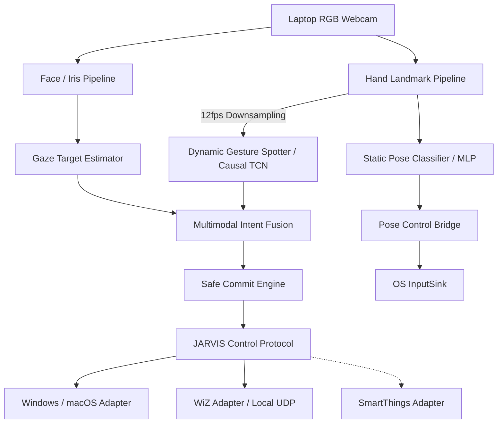

# 🤖 JARVIS

## **J**ointly **A**ligned **R**eal-time **V**ision **I**nteraction **S**ystem

> **바라보면 선택되고, 움직이면 실행된다.**
>
> 일반 노트북 웹캠으로 사용자의 시선과 손동작을 실시간 분석하여, 바라보는 전자기기를 선택하고 제스처로 명령을 실행하는 멀티모달 제어 시스템입니다.

- **GitHub:** https://github.com/madcamp-official/26s-w3-c3-05
- **프로젝트 유형:** 시선 기반 모션 제스처 전자기기 제어 OS
- **실행 환경:** Python 3.12, Windows/macOS, 일반 RGB 웹캠

---

# 팀원

| 이름 | 소속 | 담당 파트 | 주요 역할 |
| --- | --- | --- | --- |
| 김윤서 | EWHA CSE 23 | Gaze Tracking | 얼굴·홍채 추적, 사용자별 기기 등록, 시선 대상 추정, 시선·제스처 결합 |
| 박수현 | HYU CSE 22 | Dynamic Gesture | 연속 손동작 인식, Causal TCN 학습, 스마트 전구 제어 |
| 조준호 | KAIST SoC 21 | Static Gesture | 손 자세 인식, PC 입력 제어, 시스템 최적화·디버깅 도구 |

---

# 기획안

프로젝트 주제, 목적, 핵심 기능, 예상 사용자와 팀원별 역할을 정리합니다.

## 프로젝트 주제

일반 RGB 웹캠을 이용해 사용자가 바라보는 전자기기를 선택하고, 정적·동적 손 제스처로 노트북과 IoT 기기를 제어하는 멀티모달 인터랙션 시스템입니다.

## 이름 의미

**JARVIS**는 **Jointly Aligned Real-time Vision Interaction System**의 약자입니다. 시선과 손동작을 독립적으로 인식하는 데 그치지 않고, 두 신호를 시간적으로 정렬하여 하나의 조작 의도로 해석한다는 의미를 담았습니다.

## 목적

사용자가 키보드, 마우스, 리모컨이나 제조사별 앱을 번갈아 찾지 않고도 주변 전자기기를 직관적으로 제어할 수 있도록 합니다.

```text
무엇을 조작할 것인가? → 시선
어떤 동작을 수행할 것인가? → 손 제스처
언제 실행할 것인가? → Intent Fusion
어떻게 실행할 것인가? → Device Protocol
```

JARVIS의 우선순위는 많은 기능을 실행하는 것이 아니라 **사용자가 의도한 대상에만 명령을 정확히 한 번 실행하는 것**입니다.

## 핵심 기능

- MediaPipe 기반 얼굴·홍채·손 랜드마크 실시간 추적
- 사용자별 전자기기 시선 영역 등록 및 보정
- Gaze Target 추정, Target Lock, `UNKNOWN` rejection
- Causal TCN 기반 Swipe·Rotate 동적 제스처 인식
- MLP 기반 포인팅·핀치·손 자세 인식
- 시선과 동적 제스처의 시간적 결합 및 Safe Commit
- 정적 제스처 기반 커서 이동, 클릭, 드래그, 스크롤과 시스템 제어
- Philips WiZ 전구의 전원·밝기·색상 로컬 UDP 제어
- Windows Win32 및 macOS Quartz/AppKit 입력 합성
- TTL, capability 검증, 명령 ID 기반 중복 실행 방지
- PySide6 기반 실시간 모니터링·등록·진단·시연 도구

## 예상 사용자

- 여러 전자기기를 하나의 공통 인터페이스로 제어하고 싶은 사용자
- 작업 중 키보드·마우스와 스마트홈 앱을 자주 오가는 사용자
- 물건을 들고 있거나 기존 입력 장치를 바로 사용하기 어려운 사용자
- 비접촉식 공간 인터페이스와 스마트홈 자동화에 관심 있는 사용자
- 큰 시선 이동과 손동작 기반 보조 입력이 필요한 사용자

---

# 기능 명세서

구현 기능을 사용자 관점에서 정리하고 필수 기능과 확장 기능을 구분합니다.

## 필수 기능

- [x] 노트북 RGB 웹캠 입력
- [x] 얼굴·홍채 랜드마크 추출
- [x] 손 랜드마크 추출
- [x] 사용자별 기기 위치 등록
- [x] 시선 방향과 등록 영역 기반 대상 추정
- [x] 등록되지 않거나 모호한 방향의 `UNKNOWN` 처리
- [x] 일정 시간 응시 후 Target Lock 형성
- [x] 눈 깜빡임·추적 손실·홍채 튐 처리
- [x] 동적 제스처 Causal TCN 추론
- [x] `IDLE → ONSET → ACTIVE → ENDING` 제스처 상태 추적
- [x] 정적 손 자세 MLP 추론
- [x] 손 자세 dwell·release·grace 상태 머신
- [x] 시선과 제스처의 시간적 정렬
- [x] 결합 점수 기반 Intent Commit
- [x] capability·operation·value 검증
- [x] TTL 만료 명령 차단
- [x] 동일 명령 중복 실행 차단
- [x] Windows/macOS PC 입력 제어
- [x] Philips WiZ 전구 로컬 UDP 제어
- [x] 실시간 모니터링 및 디버깅 UI

## 확장 기능

- [x] SmartThings REST API 어댑터 구현
- [x] 실시간 gaze 진단 세션 녹화 및 리포트
- [x] 모델 가중치 선택 및 파인튜닝 데이터 녹화 UI
- [x] 가상 전구 상태 시각화
- [ ] 다양한 사용자·조명·거리 환경의 대규모 평가
- [ ] Smart TV, 에어컨, 선풍기 어댑터
- [ ] Home Assistant·MQTT 연동
- [ ] ESP32 IR/RF Bridge 연동
- [ ] 사용자 정의 제스처 학습

---

# 핵심 파이프라인

## 1. Gaze Tracking

MediaPipe Face Landmarker가 제공하는 478개 얼굴 랜드마크와 양쪽 홍채, 얼굴 transformation matrix를 사용합니다. 머리 yaw·pitch와 눈-머리 상대 오프셋을 합성하여 하나의 시선 방향 벡터를 만들고, 사용자별로 등록된 기기 영역과 비교합니다.

단순히 가장 가까운 기기를 선택하지 않습니다. 현재 시선이 등록 영역 안에 있는지 먼저 검사하고, 자세·거리·카메라 안 얼굴 위치를 포함한 8차원 분포로 후보의 순위를 조정합니다. 조건을 만족하는 대상이 없거나 후보가 모호하면 `UNKNOWN`으로 처리합니다.

```text
Face·Iris Landmarks
  → Head Pose + Iris Offset
  → Gaze Direction Vector
  → Temporal Smoothing
  → Registered Target Area Matching
  → Context Scoring
  → UNKNOWN Rejection
  → Gaze Lock
```

### 기기 등록

1. 기기 중앙을 응시한 채 고개·얼굴 위치·거리를 바꾸며 자세 분포를 수집합니다.
2. 고개를 고정하고 눈으로 기기의 테두리를 따라가며 정밀 영역을 확정합니다.
3. 영상 원본이 아닌 시선·자세 특징의 평균, 공분산과 경계 polygon만 JSON으로 저장합니다.

### 안전 처리

- 짧은 눈 깜빡임 동안 마지막 안정 시선을 제한적으로 유지합니다.
- 얼굴 추적이 실제로 끊기면 `TRACKING LOST`로 구분합니다.
- 등록 영역 밖의 시선은 가장 가까운 기기로 강제 분류하지 않습니다.
- 일정 시간 안정적으로 응시한 경우에만 Target Lock을 형성합니다.
- 다른 기기로 선택을 바꿀 때도 새 대상의 dwell을 다시 요구합니다.

## 2. Dynamic Gesture

동적 제스처는 한 프레임의 손 모양이 아니라 시간에 따른 손의 움직임을 인식합니다. MediaPipe가 추출한 21개 랜드마크를 손목 기준으로 정규화한 뒤 관절각, 위치 속도와 손목 이동 특징을 계산합니다. 15프레임의 causal sliding window를 Causal TCN에 입력하므로 미래 프레임을 보지 않고 실시간으로 동작합니다.

```text
Hand Landmarks
  → 2D Normalization
  → One-Euro Smoothing
  → 102-dimensional Features
  → 15-frame Sliding Window
  → Causal TCN
  → Gesture + Phase + Uncertainty
  → Gesture Event
```

지원 label은 다음 10종입니다.

- `rotate_clockwise`
- `rotate_counter_clockwise`
- `slide_two_fingers_up`
- `slide_two_fingers_down`
- `slide_two_fingers_left`
- `slide_two_fingers_right`
- `stop_sign`
- `none`
- `drumming_fingers`
- `doing_other_things`

배경 3종은 일상 동작을 명령으로 오인하지 않도록 적극적으로 학습합니다. `GestureSpotter`는 프레임별 예측을 `IDLE → ONSET → ACTIVE → ENDING` 상태로 정리하고, 한 동작을 하나의 이벤트로 출력합니다.

현재 활성 체크포인트는 웹캠 파인튜닝 데이터 843개 클립을 사용했으며, 클립 단위 validation split에서 배경 합산 8-class 기준 macro-F1 **0.9200**을 기록했습니다.

### 전구 제어 매핑

| 제스처 | 전구 기능 | 동작 |
| --- | --- | --- |
| 두 손가락 위·오른쪽 슬라이드 | 밝기 | 30 증가 |
| 두 손가락 아래·왼쪽 슬라이드 | 밝기 | 30 감소 |
| 시계 방향 회전 | 색상 | hue 60° 증가 |
| 반시계 방향 회전 | 색상 | hue 60° 감소 |
| 펼친 손바닥 | 전원 | toggle |

## 3. Static Gesture

정적 제스처는 매 프레임의 손 모양을 독립적으로 분류합니다. 21개 랜드마크의 2D 좌표 42개와 손끝 쌍거리 10개를 결합한 52차원 특징을 MLP에 입력합니다.

```text
Hand Landmarks
  → Wrist/Palm-scale Normalization
  → 42 Coordinates + 10 Fingertip Distances
  → MLP
  → Pose Confidence
  → Tilt Gate
  → Pose State Machine
  → PC Input
```

지원 자세는 다음 9종입니다.

| 자세 | 기능 |
| --- | --- |
| `index_point` | 커서 이동 |
| `middle_point` | 탭 닫기 |
| `pinch_index` | 좌클릭·드래그 |
| `pinch_middle` | 우클릭 |
| `two_fingers` | 스크롤·가상 데스크톱 전환 |
| `open_palm` / `fist` | 시스템 화면 전환 |
| `ok` | 미디어 재생·정지, 회전 시 볼륨 조절 |
| `none` | 명령이 아닌 배경 자세 |

최신 9-class 모델의 에피소드 단위 홀드아웃 정확도는 **94.6%**입니다. 단일 사용자의 2세션 데이터 기반 결과이므로 다양한 사용자에 대한 일반화 성능과 구분하여 해석합니다.

프레임별 분류 결과를 바로 실행하지 않고 `PoseStateMachine`이 자세별 dwell, release와 grace를 적용합니다. 커서는 손의 절대 좌표를 화면에 직접 매핑하지 않고 손목의 프레임 간 이동량과 속도 기반 gain을 사용하여 정밀한 작은 움직임과 빠른 큰 움직임을 함께 지원합니다.

## 4. Multimodal Intent Fusion

시선 담당 파이프라인은 시선과 동적 제스처가 하나의 조작 의도인지 판정합니다.

다음 조건을 모두 만족한 경우에만 명령을 확정합니다.

1. 등록 기기 하나가 안정적으로 Lock됨
2. Target Lock 이후 제스처가 시작됨
3. Lock TTL 안에 제스처가 완료됨
4. 시선과 제스처 confidence가 기준을 충족함
5. 제스처 uncertainty가 충분히 낮음
6. 대상 기기가 해당 capability를 지원함
7. 같은 이벤트가 이전에 실행되지 않음

```text
Fusion Score
= P(target) × P(gesture) × gaze_stability × (1 − uncertainty)
```

인식이 불확실하거나 입력이 오래되었을 때의 기본 동작은 **미실행**입니다.

## 5. Runtime & Device Control

Intent는 기기별 capability map을 거쳐 명령으로 변환됩니다. 모든 명령은 고유 ID와 TTL을 가지며, lifecycle과 ledger가 만료·중복·잘못된 상태 전이를 차단합니다.

```text
CREATED
  → VALIDATED
  → DISPATCHED
  → ACKNOWLEDGED
  → VERIFIED
```

실패 상태는 `REJECTED`, `EXPIRED`, `FAILED`, `UNVERIFIED`로 구분합니다. 전구는 명령 후 상태를 다시 읽어 실제 값이 일치할 때만 `VERIFIED`로 처리합니다.

---

# IA 및 화면 설계서

JARVIS는 웹 페이지 대신 하나의 PySide6 데스크톱 애플리케이션 안에서 기능별 탭을 제공합니다.

## 주요 화면

| 화면 | 주요 기능 |
| --- | --- |
| 실시간 | 웹캠, 손 스켈레톤, 정적 자세와 동적 제스처 상태 확인 |
| 시선 인식 | 시선 샘플 저장, 기기 등록·재등록·삭제, 진단 세션 녹화 |
| Gaze 파이프라인 | raw/smoothed gaze, head pose, target 확률과 lock 상태 표시 |
| 손 추적 | 랜드마크, 자세 분류, 속도·가속도와 smoothing 상태 확인 |
| 파이프라인 | 시선·제스처·Fusion 상태 전이 확인 |
| 지연·어댑터 | 명령 lifecycle, adapter 상태와 latency 확인 |
| 파인튜닝 | 동적 제스처 클립 녹화 및 모델 가중치 선택 |
| 시연 | 기기 매핑, Target Lock, 판정·실행 로그, 가상·실물 전구 상태 확인 |

## 사용자 흐름

```text
JARVIS 실행
  → 웹캠과 모델 로드
  → 시선 인식 탭에서 노트북·전구 등록
  → 기기 종류에 따라 laptop·room.bulb 자동 매핑
  → 시연 탭에서 실행과 대상 상태 확인
  → 기기를 바라보아 Target Lock
  → 동적 제스처 수행
  → Fusion·Safe Commit
  → 전구 명령 실행 및 상태 재확인
```

정적 PC 제어는 별도 경로로 동작합니다.

```text
손 자세 인식
  → 자세별 dwell 통과
  → 커서·클릭·스크롤·시스템 명령 생성
  → Windows/macOS InputSink 실행
```

---

# 시스템 아키텍처



---

# 데이터 및 저장 구조

JARVIS는 서버 DB 대신 로컬 JSON, 모델 체크포인트와 진단 로그를 사용합니다.

| 경로 | 설명 |
| --- | --- |
| `data/calibration/profiles.json` | 등록 기기의 시선 방향·영역·자세 분포 |
| `data/calibration/demo_device_map.json` | `target_001` 형식의 등록 ID와 런타임 기기 ID 매핑 |
| `data/evaluation/gaze_samples.json` | 수동 저장한 gaze 진단 샘플 |
| `data/diagnostics/session_*.jsonl` | 라벨된 실시간 gaze 진단 세션 |
| `configs/gesture_capability_map.json` | 기기·제스처별 capability 명령 매핑 |
| `models/*.task` | MediaPipe Face/Hand Landmarker 자산 |
| `models/*.pt` | PyTorch 동적·정적 제스처 모델 |
| `models/*.metadata.json` | 학습 데이터·버전·평가 결과 메타데이터 |

## Target Profile 주요 필드

| 필드 | 설명 |
| --- | --- |
| `target_id` | 등록 과정에서 발급되는 고유 ID |
| `name` | 사용자 지정 기기 이름 |
| `device_type` | `computer` 또는 `electric bulb` |
| `direction` | 등록 영역의 중심 yaw·pitch |
| `area_profile` | 기기 경계 polygon과 반경 |
| `feature_profile` | 8차원 특징 평균·공분산·threshold |
| `pose_correction` | 머리 각도별 gaze 보정값 |
| `requires_nod_gate` | 고개 끄덕임 확인 필요 여부 |

런타임 기기 ID는 다음 값만 사용합니다.

| 등록 기종 | 런타임 ID |
| --- | --- |
| `computer` | `laptop` |
| `electric bulb` | `room.bulb` |

---

# 런타임 인터페이스 및 명령 프로토콜

## TargetEstimate

```json
{
  "target": "room.bulb",
  "probability": 0.87,
  "second_best_probability": 0.13,
  "stability": 0.91
}
```

## GestureEstimate

```json
{
  "gesture": "slide_two_fingers_down",
  "phase": "ENDING",
  "confidence": 0.92,
  "uncertainty": 0.07
}
```

## Intent

```json
{
  "intent_id": "intent-1042",
  "target": "room.bulb",
  "gesture": "slide_two_fingers_down",
  "capability": "brightness",
  "operation": "decrement",
  "value": 30,
  "target_confidence": 0.87,
  "gesture_confidence": 0.92,
  "expires_in_ms": 1000
}
```

## Device Capability

| 기기 | Capability | 지원 동작 |
| --- | --- | --- |
| laptop | scroll | increment, decrement |
| laptop | volume | increment, decrement |
| laptop | media | toggle |
| laptop | desktop_switch | increment, decrement |
| room.bulb | power | set, toggle |
| room.bulb | brightness | set, increment, decrement |
| room.bulb | color_temperature | set, increment, decrement |
| room.bulb | color | set, increment, decrement |

---

# 모델 명세

| 모델 | 입력 | 출력 | 현재 상태 |
| --- | --- | --- | --- |
| MediaPipe Face Landmarker | RGB frame | 얼굴 478 landmarks, transform matrix | 공식 float16 bundle 사용 |
| MediaPipe Hand Landmarker | RGB frame | 손 21 landmarks, handedness | 공식 float16 bundle 사용 |
| Causal TCN | 15 × 102 feature window | gesture·phase 확률 | 웹캠 데이터 파인튜닝 완료 |
| Static Pose MLP | 52-dimensional pose feature | 9-class pose | 에피소드 홀드아웃 94.6% |

모든 모델 입력은 causal 경로를 유지하며 미래 프레임을 참조하지 않습니다. 학습과 추론의 전처리 설정이 다르면 조용히 정확도가 떨어지는 것을 막기 위해, 정적 모델은 저장된 전처리 메타데이터와 런타임 설정을 비교합니다.

---

# Tech Stack

## Vision & AI

- Python 3.12
- MediaPipe Face Landmarker
- MediaPipe Hand Landmarker
- OpenCV
- PyTorch
- Causal TCN
- One-Euro Filter
- NumPy

## Application

- PySide6
- 실시간 웹캠 모니터링 UI
- 사용자별 기기 등록·진단·리플레이 도구

## Device Control

- Windows Win32 API
- macOS Quartz·AppKit
- Philips WiZ Local UDP
- SmartThings REST API

## Quality & Verification

- Pytest
- Ruff
- mypy strict
- 클립·에피소드 단위 홀드아웃 평가
- 명령 lifecycle·TTL·deduplication 테스트
- 현재 테스트 수집 기준 **1,094개 테스트**

---

# 실행 방법

## 1. 개발 환경 구성

Python 3.12 환경을 권장합니다.

```bash
python -m venv .venv
```

Windows PowerShell:

```powershell
.\.venv\Scripts\Activate.ps1
python -m pip install --upgrade pip
pip install -e ".[vision,ml,ui,dev]"
```

macOS/Linux:

```bash
source .venv/bin/activate
python -m pip install --upgrade pip
pip install -e ".[vision,ml,ui,dev]"
```

macOS에서 실제 입력 제어가 필요하면 다음 extra를 함께 설치합니다.

```bash
pip install -e ".[vision,ml,ui,macos,dev]"
```

## 2. 모델 파일 준비

다음 MediaPipe 모델을 `models/`에 배치합니다.

```text
models/face_landmarker.task
models/hand_landmarker.task
```

동적·정적 제스처 가중치는 다음 경로를 사용합니다.

```text
models/gesture_tcn_finetuned.pt
models/gesture_tcn_finetuned.pt.metadata.json
models/hand_pose_classifier.pt
```

모델 확보 및 재현 방법은 [models/README.md](models/README.md)를 참고합니다.

## 3. 모니터 실행

```bash
jarvis-monitor
```

시연 탭으로 바로 시작:

```bash
jarvis-monitor --demo
```

시선 추론을 끄고 손 추적만 진단:

```bash
jarvis-monitor --no-gaze
```

다른 카메라 사용:

```bash
jarvis-monitor --camera 1
```

## 4. 검증

```bash
pytest
ruff check src tests training
mypy
```

---

# 주요 환경 변수

환경별 값은 `.env`에 저장하고 실제 secret은 저장소에 커밋하지 않습니다.

```dotenv
# Philips WiZ: device_id → IP, MAC 또는 MAC@IP
WIZ_DEVICE_TARGETS={"room.bulb":"AA:BB:CC:DD:EE:FF@192.168.0.20"}

# SmartThings 확장 어댑터
SMARTTHINGS_TOKEN=
SMARTTHINGS_DEVICE_TARGETS={}
```

WiZ는 같은 LAN의 UDP 38899 포트를 사용합니다. `MAC@IP` 형식을 사용하면 평소에는 IP로 바로 연결하고, 응답이 없을 때 MAC 기반 재탐색으로 DHCP 주소 변경에 대응합니다.

---

# 평가 지표

JARVIS는 프레임 단위 정확도뿐 아니라 실제 제어 안전성과 반응 시간을 평가합니다.

| 평가 지표 | 목표 |
| --- | ---: |
| Target Selection Accuracy | 90% 이상 |
| Gesture Event Recall | 90% 이상 |
| Wrong Actuation Rate | 1% 이하 |
| Duplicate Actuation | 0회 |
| 노트북 End-to-End p95 Latency | 150ms 이하 |
| 스마트 전구 End-to-End p95 Latency | 1000ms 이하 |

위 값은 프로젝트 목표이며, 실제 측정 결과는 데이터셋·환경·측정 시점과 함께 기록합니다. 목표값과 실측값을 혼용하지 않습니다.

---

# 시연 시나리오

## 1. 시선 대상 등록

노트북과 전구를 각각 등록하고 `computer → laptop`, `electric bulb → room.bulb` 매핑을 확인합니다.

## 2. 동적 제스처 인식

웹캠 앞에서 두 손가락 슬라이드와 회전 동작을 수행하고 `ONSET → ACTIVE → ENDING` 상태와 confidence를 확인합니다.

## 3. IoT 전구 연동

전구를 바라보아 Target Lock을 만든 뒤 슬라이드로 밝기를, 회전으로 색상을, 펼친 손으로 전원을 제어합니다.

## 4. 정적 제스처 PC 제어

검지 포인팅으로 커서를 이동하고 핀치로 클릭·드래그하며, 두 손가락으로 스크롤과 가상 데스크톱 전환을 수행합니다.

## 5. 오작동 차단

- 아무 기기도 바라보지 않고 제스처 수행
- 전구를 바라보면서 물 마시기
- Target Lock 만료 후 제스처 수행
- 손·얼굴 추적이 끊긴 상태에서 동작 수행
- 같은 command ID를 두 번 전달

모든 경우 명령이 실행되지 않거나 중복이 차단되는지 판정·실행 로그에서 확인합니다.

---

# 확장 가능성

JARVIS는 제조사 대신 `power`, `brightness`, `volume`, `temperature`와 같은 capability를 중심으로 기기를 표현합니다. 새 기기를 추가할 때 시선·제스처·Fusion 코어를 바꾸지 않고 새로운 adapter와 capability mapping만 추가할 수 있습니다.

- 스마트 TV
- 에어컨과 선풍기
- 스마트 플러그
- Home Assistant·MQTT 기기
- ESP32 IR/RF Bridge 기반 구형 가전
- 접근성 보조 입력 장치
- 공간형 컴퓨팅 인터페이스

---

# 프로젝트 문서

| 문서 | 내용 |
| --- | --- |
| [documents/gaze.md](documents/gaze.md) | 시선 추적·등록·보정 상세 |
| [documents/gesture-fusion.md](documents/gesture-fusion.md) | 동적·정적 제스처와 Intent Fusion |
| [documents/runtime-protocol.md](documents/runtime-protocol.md) | 런타임·명령 프로토콜·기기 어댑터 |
| [documents/interface-contract.md](documents/interface-contract.md) | 모듈 간 메시지 계약 |
| [documents/decisions.md](documents/decisions.md) | 주요 기술 의사결정과 근거 |
| [documents/development-principles.md](documents/development-principles.md) | 개발·검증·안전 실행 원칙 |
| [models/README.md](models/README.md) | 모델 버전·입력·전처리·평가·확보 방법 |

---

# 마무리

JARVIS는 시선과 손동작을 각각 인식하는 데서 끝나지 않습니다. 사용자가 바라보는 대상, 손동작의 의미, 두 행동이 발생한 시간과 불확실성을 함께 해석하여 사람의 조작 의도를 실제 전자기기 명령으로 변환합니다.

> **무엇을 바라봤는지가 아니라, 무엇을 조작하려 했는지를 판단한다.**
